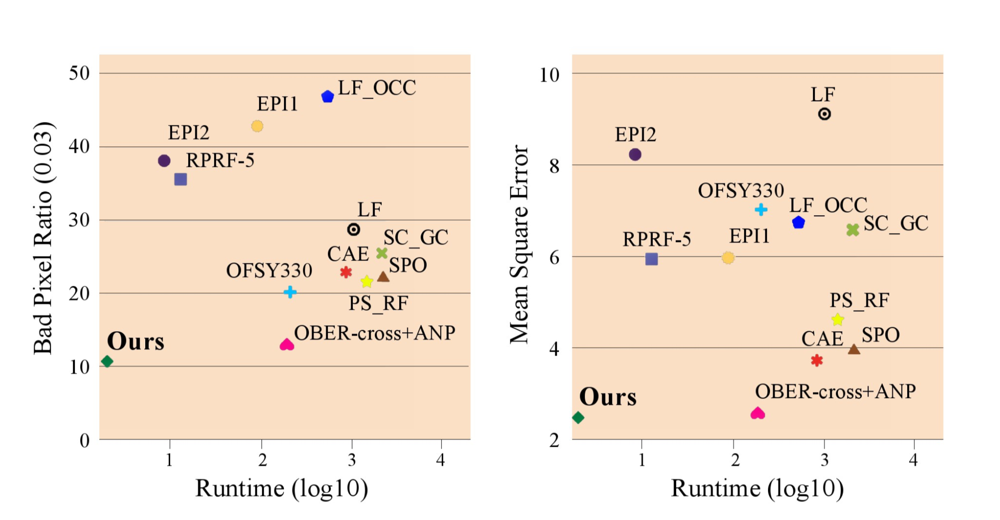
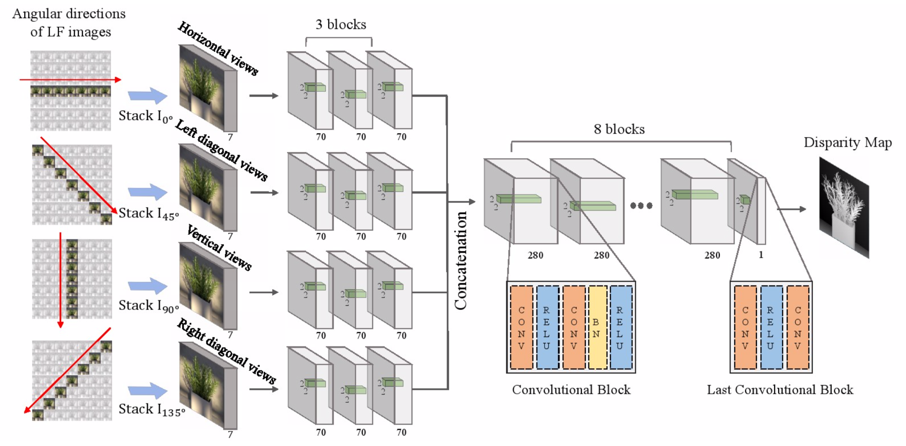

## EPINET：利用光场图像深度极线几何的全卷积神经网络

EPINET: A Fully-Convolutional Neural Network Using Epipolar Geometry for Depth from Light Field Images

Changha Shin - CVPR 2018

### 摘要

光场相机捕获空间包括光线的空间和角度特性。由于其特性，人们可以在不受控制的照明环境中从光场计算深度，这是有源传感设备的一大优势。从光场计算的深度可用于许多应用，包括3D建模和重新聚焦。然而，来自手持相机的光场图像具有非常窄的基线和噪声，使得深度估计变得困难。已经提出了许多方法来克服光场深度估计的这些限制，但是在这些方法中的精度和速度之间存在明显的折衷。在本文中，我们介绍了一种基于全卷积神经网络的快速准确的光场深度估计方法。我们的网络是通过考虑光场几何设计而设计的，我们还通过提出光场特定数据增强方法来克服缺乏训练数据的问题。在大多数指标上，我们在HCI 4D光场基准测试中取得了最高排名，我们还展示了所提方法在真实世界光场图像上的有效性。

### 1. 介绍

光场相机收集并记录来自不同方向的光。 作为计算摄影领域引入的最先进技术之一，新型手持式光场摄像机设计对摄影产生了广泛的影响，因为它改变了图像的捕获方式，使用户拍摄后能够改变视点或焦平面。

自从引入相机阵列系统以来，已经提出了许多用于制造紧凑和手持式光场相机的方法，如基于小透镜的相机，其利用放置在成像传感器前面的微透镜阵列。 从基于小透镜的相机捕获的图像可以通过几何校准过程转换为具有略微不同视点的多视图图像。 由于这种特殊的相机结构，可以使用光场相机来估计不受控制的环境中场景的深度。 这是光场相机优于有源传感装置的关键优势之一，其需要受控照明并因此限于室内使用。

另一方面，手持式光场相机有其自身的局限性。 由于它们的结构，子孔径图像之间的基线非常窄并且在受限制的图像传感器分辨率内存在空间和角分辨率之间的折衷。 已经引入了各种方法来克服这些限制并获得精确的深度图。 这些方法在接近其他基于无源传感器的深度估计方法（例如立体匹配）方面实现了良好的性能，但由于其繁重的计算负担而不太实用。 尽管已经提出了几种快速深度估计方法，但它们失去了获得速度的准确性。

在本文中，我们介绍了一种基于深度学习的光场深度估计方法，可以获得准确的结果和快速的速度。 使用卷积神经网络，我们可以在几秒钟内估算出具有亚像素精度的精确深度图。 我们在大多数质量评估指标上实现了HCI 4D光场基准测试的最高排名，包括坏像素比、均方误差和运行时间，如图1所示。

图1：光场深度估计算法的准确度和运行时间的比较。 我们的方法在准确性和速度方面均达到了HCI 4D光场基准测试的最高排名。 我们的方法比OBER-cross + ANP快85倍，这在准确度排名中排名第二。

在我们的深度网络设计中，我们为子孔径图像的四个角度方向（水平、垂直、左和右对角线）创建四个独立但相同的处理流，并在稍后阶段将它们组合。 利用这种架构，网络被约束为首先独立地产生子孔径图像的四个方向的有意义的表示。 稍后组合这些表示以产生用于深度估计的更高级别表示。

将深度学习应用于光场深度估计的一个问题是缺乏数据。 公开可用的光场数据集不包含足够的数据来训练深层网络。 为了解决这个数据不足的问题，我们还提出了一种特定于光场成像的数据增强方法。 我们通过适合光场图像的缩放、中心视图更改、旋转、转置和颜色来增强数据。 我们的数据增强在提高网络的可训练性和深度估计的准确性方面起着重要作用。

### 2. 相关工作

相关工作可以分为两类：使用优化方法和基于学习的方法。

##### 基于优化的方法

使用光场图像进行深度估计的最具代表性的方法是使用极线平面图像，其由2D切片角度和空间方向组成。 由于EPI由具有各种斜率的线组成，因此内在尺寸远低于其原始尺寸，这使得图像处理和优化易于进行深度估计。 Wanner和Goldluecke使用结构化张量来计算EPI中的斜率，并使用快速总视差去噪滤波器来细化初始视差图。 Zhang还使用EPI找到匹配线，并提出了旋转平行四边形算子，以消除遮挡对深度估计的影响。

另一种方法是利用散焦和对应线索。散焦提示在重复纹理和噪声方面表现更好，并且对应提示在亮点和特征中是稳健的。 Tao首先提出了一种结合散焦和对应线索的深度估计。后来通过在[31]中添加基于着色的细化技术和在[34]中使用遮挡项进行正则化来改进这种方法。 Williem和Park提出了一种对噪声和遮挡具有鲁棒性的方法。它通过使用角熵度量和自适应散焦响应以获得一个新颖的数据损失。

已经提出了许多其他方法来改善来自光场图像的深度估计。 Heber和Pock提出了一个全局匹配项，它在子孔径图像堆栈上形成低秩最小化。 Jeon采用了基于相位的子像素移位的多视图立体匹配。基于多视图立体对的方法实现了来自真实世界光场图像的度量3D重建（metric 3D reconstruction）。

这些传统的基于优化的方法在计算时间和性能之间具有不可避免的折衷。在本文中，我们采用卷积神经网络框架来获得速度和准确性。

##### 基于学习的方法

近来，机器学习技术已经应用于各种光场成像应用，例如超分辨率、新颖视图生成、单个图像到光场图像转换、以及材料识别。

对于深度估计，Johannsen提出了一种技术，该技术使用EPI补丁来组成具有相应已知差异的字典。这种方法在多层场景中产生了更好的结果。Heber提出了一种由编码和解码部分组成的端到端深度网络架构。 Heber和Pock提出了CNN和变分优化的组合。他们训练CNN预测EPI线方向，并制定了具有更高阶正则化的全局优化，以改进网络预测。

在上述基于学习的方法中仍存在问题。这些方法在设计网络时仅考虑光场图像一个方向的极线几何，导致深度预测的可靠性低。我们通过多流网络克服了这个问题，该网络分别对每个极线图像进行编码以改善深度预测。由于每个极线图像都有自己独特的几何特征，我们将极线图像分成多个部分，使深层网络充分利用这些特征。另一个问题是训练数据不足会限制学习模型的判别力并导致过度拟合。在这项工作中，我们提出了新的光场图像数据增强技术，可以在没有过度拟合的情况下获得良好的结果。

### 3. 理论方法

#### 3.1 光场图像的极线几何

借助以往工作的观点，我们利用光场几何特征从光场图像设计了一个端到端的神经网络架构。 由于光场图像在垂直和水平方向上具有许多角度分辨率，因此数据量远大于立体相机的数据量。 当使用光场图像的所有视点作为输入数据时，尽管能得到精确的光场深度结果，但计算速度比立体深度估计算法慢几百倍。 为了解决这个问题，一些论文提出了仅使用光场图像的水平或十字形视点的算法。 类似地，我们通过利用视点的角度方向之间的光场特性来首先减少要用于计算的图像的数量，从而提出深度估计流水线。

4D光场图像表示为$L ( x , y , u , v )$，其中$( x , y )$是空间分辨率，$( u , v )$是角分辨率。 中心与光场图像的其他视点之间的关系可表示如下：

$L ( x , y , 0,0 ) = L ( x + d ( x , y ) * u , y + d ( x , y ) * v , u , v )$

其中$d ( x , y )$是中心视点中像素$( x , y )$与其相邻视点中的对应像素的视差。

对于角度方向$\theta$（$\tan \theta = v / u$），我们可以重新表述如下关系：

$L ( x , y , 0,0 ) = L ( x + d ( x , y ) * u , y + d ( x , y ) * u \tan \theta, u , u \tan \theta )$

然而，视点索引是整数，因此当$\tan \theta$是非整数时没有对应的视点。 因此，假设光场图像具有$( 2 N + 1 ) \times ( 2 N + 1 )$角分辨率，我们在四个视点角度$\theta : 0,45,90,135$度的方向上选择图像。

#### 3.2 网络设计

##### 多流网络

如图2所示，我们构建了一个基于第3.1节的基于一致基线的四个视点的多流网络：水平、垂直、左右对角线方向。 与传统的光流估计和立体匹配方法类似，我们在网络的开头分别对每个图像堆栈进行编码。 为了显示多流体系结构的有效性，我们定量地将我们的多流网络与单流网络进行比较。 如图3所示，即使使用与单流网络相同数量的参数，使用所提出的方法的重建误差也低约10％。 使用这种架构，网络被限制为首先产生四个视点的有意义的表示。

图2：EPINET：我们的光场深度估算架构。

为了显示网络中不同数量的流的影响，我们将网络的性能与不同数量的流进行比较。 使用具有几乎相同数量的参数（5.1M）的相同架构，我们将表1中不同数量的流的网络性能差异进行比较。具有四个流的网络在坏像素比率方面表现出最佳的性能 和均方误差。

在多流部分之后，我们连接每个流的所有特征，并且特征的大小变大四倍。 合并网络由八个卷积块组成，它们查找通过多流网络传递的特征之间的关系。 除了最后一个块之外，合并网络中的块具有与多流网络相同的卷积结构。 为了用子像素精度推断视差值，我们用Conv-ReLU-Conv结构构造最后一个块。

#### 3.3 数据扩充

尽管存在一些公共光场图像数据集，但是其中只有少数具有与具有基本真实视差图的真实光场图像类似条件的数据。 在本文中，我们使用了包含各种纹理、材料、对象和[14]中提供的窄基线16个光场合成图像。 然而，仅仅16个光场图像不足以推广卷积神经网络。 为防止过度拟合问题，数据增强技术至关重要。 因此，我们提出了一种光场图像特定数据增强技术，其保留了子孔径图像之间的几何关系。

我们的第一个策略是移动光场图像的中心视点。 我们使用的合成光场数据集具有9×9个视图，每个视图具有512×512的空间分辨率。 如图4所示，我们选择7×7视图和中心视图的不同图像来训练我们的网络。 通过改变中心视图，我们可以通过视图转换策略获得九倍以上的训练集。 根据视点数量和视图移位增强来验证性能，我们使用$3 \times 3,5 \times 5,7 \times 7$和$9 \times 9$输入视图比较网络的性能。 如表2所示，我们发现在增加输入视图的数量时会有性能提升。 然而，当将9×9视图与7×7视图进行比较时，增益是微不足道的。 7×7视图显示均方误差中的更好性能。 这显示了我们视角转换增强的有效性。

我们还提出了一种用于光场图像的旋转增强方法。如在深度估计和使用深度学习的光流估计中那样，空间维度中的图像旋转已被广泛用作增强技术。然而，不能直接使用传统的旋转方法，因为它没有考虑光场图像的方向特性。在我们网络的多流部分，我们提取视点集的极线特性的特征。为了保持这种光场特性，我们首先在空间维度上旋转子孔径图像，然后重新排列视点集和流的连接，如图5所示。这种重新排列是必要的，因为旋转后几何特性会发生变化。例如，垂直方向上的像素在垂直视图中彼此强烈相关，如3.1节所述。如果我们将垂直视点中的子孔径图像旋转90度，则使水平视图网络流看到垂直特征。因此，旋转的子孔径图像应该输入到垂直视图流。

我们还使用一般的增强技术，例如缩放和翻转。 当图像是比例时，视差值也需要相应地缩放。 我们将图像和视差的比例调整$1/ N$倍（$N = 1,2,3,4$）。 当翻转光场图像时，视差的符号被反转。 利用这些增强技术：视图移位、旋转（90、180、270度）、图像缩放（0.25、1）、颜色缩放（0.5、2）、从0到1随机将颜色转换为灰度、伽马值从0.8到1.2、以及翻转，我们可以将训练数据增加到原始数据的288倍。

我们验证了光场特定增强的有效性。 如表2所示，使用旋转和翻转时性能会有很大提升。 我们还观察到缩放增强允许覆盖各种视差范围，这对于具有非常窄基线的真实光场图像是有用的。 通过增强技术，我们将差异误差减少了40％以上。

#### 3.4 学习细节

我们通过从16个合成光场图像中随机采样尺寸为23×23的灰度斑块来逐小块地训练。 为了提高训练速度，层中的所有卷积都在没有零填充的情况下进行。 我们排除了一些包含反射和折射区域的训练数据，例如玻璃、金属和无纹理区域，这会导致错误的对应关系。 在图6中手动掩蔽了反射和折射区域。我们还去除了无纹理区域，其中中心像素和贴片中的其他像素之间的平均绝对差值小于0.02。

作为我们网络中的损失函数，我们使用了对异常值稳健的平均绝对误差（MAE）。 我们使用Rmsprop优化器并将批量大小设置为16。学习率从1e-5开始并降低到1e-6。 我们的网络需要5到6天才能在NVIDIA GTX 1080TI上训练完成，实现基于TensorFlow。

### 4. 实验

在本节中，使用合成和真实数据集评估所提算法的性能。 4D光场基准用于合成实验。 该基准测试具有9×9角度分辨率和512×512空间分辨率。 对于真实世界的实验，我们使用了Lytro illum捕获的图像。

#### 4.1 定量评估

对于定量评估，我们使用4D光场基准测试中的测试集来估计视差图。 针对12个光场测试图像计算坏像素比和均方误差。 使用坏像素比的三个阈值（0.01、0.03和0.07像素），以便更好地评估困难场景的算法的性能。

在图7中，我们直接参考排名表，这些排名表发布在基准网站上。 我们的EPINET在4项指标中有3项表现最佳。 Epinet-fcn是我们的EPINET模型，使用垂直、水平、左对角线和右对角线视点作为输入，Epinet-fcn 9x9是使用所有9×9视点的模型。 Epinet-fcn-m是我们Epinet-fcn的修改版本。 Epinet-fcn-m通过翻转和旋转（90、180、270度）给定的光场图像来预测多个视差图。 最终估计是估计的视差图的平均值，这减少了匹配的模糊性。 除了准确性之外，EPINET实际上是最先进方法中最快的算法，如图8所示。我们的计算时间仅次于MVCMv0，但其深度精度是基准测试中的最高。

定性结果（棉花、盒子和点）如图10所示。棉花场景包含光滑的表面，盒子场景由具有深度不连续遮挡的倾斜物体组成。从示例中可以看出，我们的EPINET比以前的方法更好地重建了光滑表面和锐利深度不连续性。 EPINET通过网络中的回归部分推断出准确的视差值，因为我们的完全卷积层可以精确地区分EPI斜率的细微差别。 Dots场景受到图像噪声的影响，其水平在空间上变化。再一次，所提出的方法在这个噪声场景中实现了最佳性能，因为2×2内核具有减轻噪声影响的效果。

在EPINET和其他最先进的基于深度学习的方法之间的直接比较可以在表3和图9中找到。我们在[12,13]的作者提供的250个LF图像上训练了EPINET，其基线是（-25，5）像素。 EPINET仍然优于[12,13]中的工作。我们用于解决方向匹配模糊的多流策略可以捕获尖锐的物体边界，如飞机的机翼和玩具的头部。性能更好的另一个原因是[12,13]的LF图像包含高度纹理化的区域，与HCI数据集相比噪声更小。

#### 4.2 现实世界的结果

我们证明我们的EPINET还可以在真实的光场图像上获得可靠的结果。我们使用由[6]的作者提供的Lytro illum相机拍摄的光场图像。现实世界的数据集具有挑战性，因为数据包含具有深度不连续性的平滑和倾斜表面的组合。另外，由于相机中固有的结构问题，这些图像遭受严重的图像噪声。在图11中，我们使用输入视点7×7和9×9比较来自EPINET的不平等预测。尽管两种EPINET的性能在合成数据中是相似的，但在现实世界中两者之间存在显着的性能差异。在[37]中，已经表明，来自光场的深度估计的准确度随着更多的观点而改善，因为它们代表所有输入视图的一致性。因此，我们使用具有9×9输入视点的EPINET进行实际实验。我们还使用常规加权中值滤波器仅针对现实世界数据集去除稀疏视差误差。

图13将定性结果与先前的方法进行了比较。 虽然[16]中的工作显示了良好的结果，但是通过仔细的参数调整，该方法需要几分钟的深度估计。 相比之下，我们的EPINET在没有任何参数调整的情况下更快地实现了最先进的结果。 精确的视差图可以促进许多应用。 作为一个例子，我们使用我们的方法计算的深度重建了Lytro illum相机在度量中捕获的对象的3D结构。 在图12中，使用由[6]的工具箱估计的校准参数将视差图转换为度量的3D模型。 令人印象深刻的结果表明，所提出的方法可以用于3D打印等进一步的应用。

### 5. 总结

在本文中，我们提出了一种使用光场几何的快速准确的深度估计网络。

我们的网络设计考虑了光场极线几何，使用多流网络和合并网络的组合来学习角度和空间信息。此外，我们还引入了光场图像特定的数据增强功能，例如视图移位和旋转。使用所提出的方法，我们可以克服不充分的数据问题，并在光场图像基准以及真实世界的光场图像上表现出最先进的结果。

我们仍然有改进我们方法的空间。首先，改进基于CNN的方法的最简单方法是增加实际数据集的数量。其次，我们的网络无法推断出反射和无纹理区域的准确差异。为了解决这个问题，我们认为对象材料等先验知识可以包含在未来的工作中。我们还期望通过融合光度提示或深度边界提示来改进我们的网络模型。