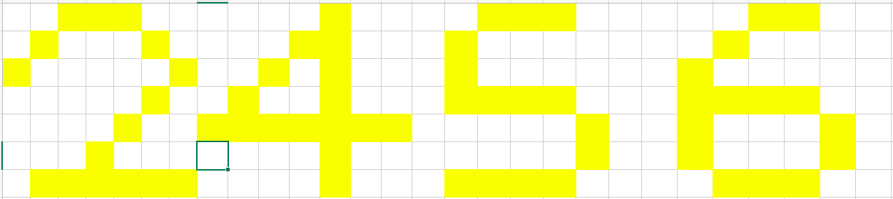
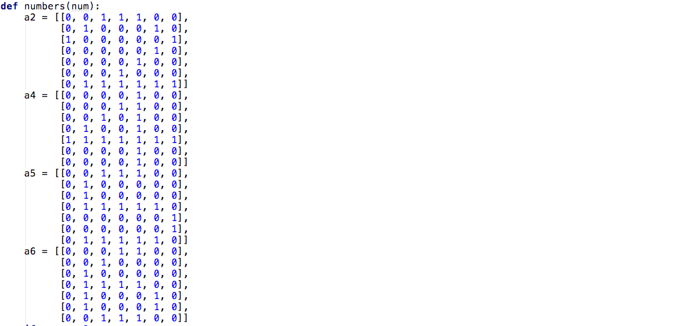
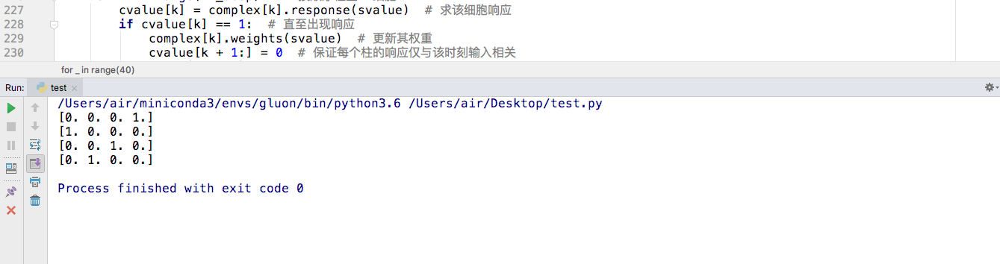

## 类脑视觉模式学习算法原型实验报告

本实验报告是原型设计中实验设计章节对应实验的报告，该研究的主要目的是依据人脑对视觉信息处理的原则设计算法实现基本视觉特征的学习和高级视觉模式的学习。

初期实验的目的是按照人脑学习的方式，实现对多次重复的模式的提取和稀疏表示。实验第一阶段期望的成果是：对MNIST手写数字数据集能够无监督地学习出10个数字的稀疏向量表示。目前，实验初步可行性研究阶段（第零阶段）已经完成，汇报如下。

### 1. 实验设计的关键启发式思想

本实验的实质是，依照数据的重要性对数据进行降维的实验，数据重要性的依据设计为重复出现的次数。

- 大脑通过重复来学习模式，而不是监督信号。

  首先，在人类的学习过程中，监督信号显然无法直接输入到人脑中，人脑能直接使用的信号更类似与强化学习中的奖励信号。人类的行为动机，起源于丘脑对特定高层神经元响应产生的愉悦或难受激素，构成了人类所有欲望的本愿。

  如在人民卫生出版社出版的第8版《生理学》一书的神经科学章节中提到的，刺激动物的内侧视前区可引起性行为的表现，而破坏该部位，则会导致性冷漠和性行为的丧失。

  人是根据特定神经元的放电和特定激素的释放来确定奖励信号的，虽然哲学不在我们讨论范围内，但本人相信，人本质上即是一种生物性质的高级决策机器，主要由不安全感和性欲指导决策，如同草履虫通过营养浓度梯度导致膜上受体产生电信号指导决策一样，生物的神经系统都是自然选择下来的、能最有效根据环境产生决策的策略模式。

  所谓监督信号，在人脑中属于对联系的学习。在MIT于2016年出版的《Principles of Neural Design》一书中提到，大脑通过多巴胺神经元实行时间差分学习，大脑产生预测，当预测与环境不一致时大脑产生学习行为。因为“苹果”这一词与苹果的实体总是同时出现，大脑会预测苹果的特征出现时“苹果”的词也一并响应，但当一个不那么像苹果的苹果出现时，大脑并未预测其为苹果，此时若有人告知此为苹果，那么大脑的预测与环境产生误差，进行学习。这可以说是人类对监督信息的实际学习方式。

  然而，在大脑获得监督信息前，大脑便已经能够对时空模式作出一定的分类。对于明显的不同模式，大脑早在监督信号出现前便能够分类了。一个人看了无数手写数字图片，但并没有人告知每张图片对应的真实数字时，人类也能对其作出极高正确率的判断。这种模式的学习能力，源于大脑能够对多次重复的模式加深记忆。《Principles of Neural Design》提到了Shtyrov等人于2010年做的一个实验，用以证明大脑通过重复学习出大量噪声中的有用信息。该实验用一个没有语义的发音刺激大脑，起初大脑语言复合区无响应，在14分钟内重复该次160次后，该词的响应与带有语义的词响应一致。实验说明了大脑并非通过语义学习了词的发音，而是通过重复。

- 视觉系统的结构

  从多数神经生物学相关文献中，我们获知，视网膜细胞经过四层连接后将信息整合为编码对比度信息的120万神经节细胞，通过丘脑外侧膝状核的中继细胞中继，连接到初级视皮层。经过不断级联，内侧颞叶MT区产生了对复杂模式特定响应的神经元。具体细节参见《视觉学习系统的神经设计原则》报告。

- 神经系统的发育模式

  科学出版社出版的《发育神经生物学》一书中提到几个关于重复学习的发育实现相关的想法：

  1. 突触的权重和连接为储存信息的位点。突触权重的改变依赖于突触后神经元的响应，当突触前与突触后神经元响应无关时，突触权重不变。
  2. 突触早期是过量产生的，并且很快便能与突触后神经元形成有效连接。过量的连接在突触后神经元上产生竞争，活化的突触在竞争中处于优势，失活的突触最终被神经元修剪。
  3. LTP可以通过重复被增强和延长。LTP需要同时被临界数量的突触激活而诱导，并且当一个强的输入（大数量的突触）与一个比较弱的输入（小数量的突触）同时出现时，弱的输入能得到增强。
  4. 在灵长类视觉发育过程中，视网膜神经元存在自发放电现象，这种放电以一定频率以带波的形状扫过整个视网膜，并且每次波的扩散都沿不同的方向。若是阻止这个过程，则视觉系统无法正常发育。

- 另外有些重要的假设为个人猜想，在文献中未有提及，由于都是非常细节的部分，推测是生命科学暂时无法确认的实验。

  1. 中继细胞轴突末端与视皮层细胞形成突触，位于底层的细胞最先形成突触，随着发育形成对某个方位的特定识别。
  2. 神经元放电方位随着突触不断向后延展而不断改变，最终初级视皮层形成连续变化的方位柱。

### 2. 实验设计与结果   

可行性阶段实验采用了7x7的01二值矩阵作为输入，输入为2、4、5、6四个数字的类似手写模式：

写成矩阵形式为：

实验设计为两层细胞，第一层细胞将7x7的输入矩阵转化为3x3x6的稀疏矩阵，对应于CNN，第一层细胞的感受野为3x3，stride为2，filters为6，输出为3x3x6。这6个filters与CNN中的概念不同，在每次刺激时仅有1个filter响应，其余为0，为高度稀疏的编码。

第二层细胞输入为第一层细胞的响应，输出为长度为8的向量。

整体想法是将7x7的2值矩阵共2的49次方种模式，先压缩为6的9次方种可能模式，再压缩为16种模式。实际上，四种数字的固定输入总共也就能激活4种模式，所以实验可以压缩至3x3x4和1x4的输出，更多的数字则有更多的模式。

通过设计两层细胞的响应方式和权重更新方式，我们最终得到了具有完全稀疏响应的模式向量。

### 3. 下一阶段的工作

下一阶段我们主要是解决MNIST手写数字无监督分类的问题，我们期望能够得出一个大小不超过50的向量，对10种数字实现完全可分。

需要解决的问题有以下几点：

1. 模糊性的输入需要容许一定程度的信息丢失以提取出关键模式，细胞对模式的响应需要加入较大的冗余度。
2. 第一层细胞感受野需要扩大，连接数不能再局限于3个，权重更新方法和参数也可能需要调整，stride的选择也需要实验。
3. 紧接第一层细胞后级联的细胞需要加入更多的层数，具体设计均需要实验尝试调整。