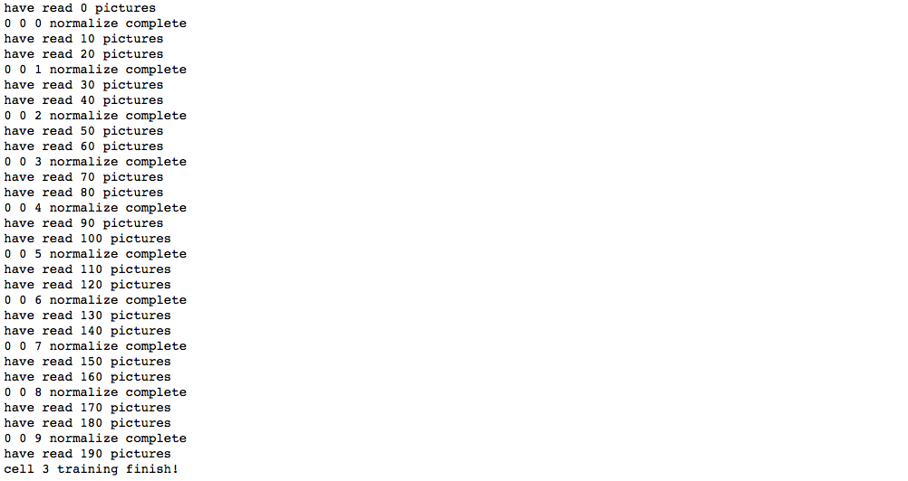

## 类脑视觉算法第二阶段实验报告

### 1. 实验具体设计

具体实验设计与上一份报告《类脑视觉算法第二阶段实验设计》中的设计基本一致，现描述如下：

#### 第一层细胞

作为模式学习的级联细胞层共三层。第一层细胞由预训练确定权重，输入数据为预训练数据，数据由我本人通过Photoshop画的8条方位线图片转换而来。具体是建立160x160的空白图片，然后手画8个方位，通过将80x80的空白图片从160x160图片底部的(0, 0)坐标沿对角线不断移动到(80, 80)坐标，每次移动产生一张图片作为刺激，以模拟视网膜神经节细胞的波形扩散放电。输入图片经过布尔值变化变为01矩阵作为输入。

第一层细胞设计感受野为5x5，大于生理学上大致3x3的感受野，以弥补二值矩阵丢失的信息。跳跃间隔第一次大胆采用了不重合的设计，主要是考虑到生理学上初级视皮层方位柱的大小不适合重合感受野的设计。激活要求为4个同时响应，最大连接数也为4，不加入冗余。权重更新和先前一样，采用了较简单的方式，这里拥有大量提升的可能性。输出模式期望是8种方位，不过考虑到一些变动的可能性，结合实验结果，设计时采用了12的深度。也就是输出为16x16x12的柱稀疏矩阵。

实验结果表明，基本所有细胞均能习得8种以上的模式数。第一层细胞训练较为耗时，为方便实验，训练完成后我们将权重储存，之后正式训练时再导入。

#### 级联层细胞

级联层细胞的设计在生理学上的参考十分稀少。对于MNIST手写数字数据集，由于多数图片形状妖孽，对于初期的实验十分不利，为了简化实验，使实验先暂且能够成功，我采用了自己使用Photoshop画的10张80x80的手写数字图片。需要注意的是，为了能使实验至少成功分离出模式，我仅仅采用了这10张图片重复输入，这意味着我们的模型仅仅实现了模式的分离能力，但却不一定拥有对模式的归类能力，换句话说，我们可以猜测，目前的模型对于稍微变化一点的手写数字便会失去激活响应能力。这个关于模型泛化性的问题，我们会在之后的工作中尝试解决。这10张图片，我们先对其做了二值化处理，然后依据生理学中视网膜阶段的信息处理过程，我们对图片取了对比度信息，作为输入。

图片首先输入到预训练的第一层细胞，然后获取第一层细胞的响应。第一层细胞权重在预训练后不再更新，作为固定滤波器。

第二层及第三层细胞均采用了4x4的感受野，依旧采用了不重合的设计原则，激活要求为4个同时响应，最大连接数也为4，也不加入冗余。这里的设计应该是不合理的，高层神经元应该有冗余响应能力，不过暂时为了分离模式，未采用冗余的设计。第二层深度实验中检测到了单神经元最多9种的模式，设计上采用了12的深度。第三层由于没有冗余输入模式仅有10种，所以最终也就输出10种模式。

### 2. 实验结果及分析

实验成功输出了10张图片的分离响应，证明了8种方位的第一层预训练是确实有效的。而且，神经元的设计不是完全不合理的，至少拥有模式分离的能力。但实验依旧没有解决任何关键问题，如模式的尺度不变和平移不变，对特征的识别更类似于死记硬背型，距离实验真正成功还有很长的路要走。

### 3. 实验的可能改进点

首先是输入数据的变化。预训练数据我们暂时不做改变，但为了检测模型泛化性，我们必须增加不同手写数字的输入测试，以期望模型真正能识别模式，而不是记忆。MNIST数据集目前我们依旧不打算使用，我们同样使用Photoshop画的数字扩充数据集。若是能真正对不同的模式有很好的区分度，而对相似的模式有很好的聚集度，则我们可以说我们算法的可行性研究真正完成了。

主要提高点预计在以下几个方面：

- 权重更新的设计
- 感受野大小的调整
- 最大连接数与最小激活数的调整
- 响应程度的分级设计

令人看不到希望的一点是，无论我们在此阶段如何设计更冗余的连接，我们只能得到很小尺度的不变性，而对于平移不变性和尺度不变性更是令人绝望地没有办法实现。特征方位等的相对排列应该是我们学习的目标。目前我们只能设想高层神经元拥有类似于ResNet的跨级连接方式一样，从较小的感受野和较大的感受野共同接收信息，以尝试实现尺度不变。而平移不变性，我们只能设想大脑通过注意力机制来使关心的模式位于感受野中心。对于算法设计，我们只能认为视觉高分辨区大致200x200的区域为注意区域，我们所有图像模式均位于200x200画布的中心，些许的平移通过翻倍的神经元表示来记忆。虽然这样的算法设计或许就真的是人脑实现的模式，但直觉上我们还是觉得效率太低，我们期望着更有效率更加漂亮的算法的出现。

另外，另一项实验我们打算并行执行。我们将在我们的网络中加入能够识别时序模式的神经元，这也是我们这个算法的核心目的。

### 4. 关于实验向通用智能发展的思路

我们猜想，关于模式的尺度不变和平移不变很可能涉及到大脑高层神经元的反馈活动。生理学有证据表明，大脑执行决策和学习的方式十分类似于时间差分算法。目前我们按照解剖学证据设计的类脑视觉算法很难解决模式识别中的尺度不变和平移不变特性，而我们大脑中关于模式的概念却很少与模式大小和视网膜上的具体位置相关，这意味着如果我们大脑中存在响应特定模式的神经元，我们将有大量神经元拥有全视网膜的感受野，并且可以被任何相关的特征所激活，并被不相关的特征所抑制。一种想法是设计大量神经元负责识别各个大小的模式，但人脑对于未见过的更大或更小的熟悉模式均能非常轻松的识别而不需要学习的过程，过多神经元对同一模式的表示也显得效率极低。所以我们猜想，大脑中是否存在一种放大缩小和平移算法来尝试匹配记忆中的已知模式。若真是如此，那么算法层面上的设计将会面临许多思维上的难题，对此，我们还无法给出任何有力的答案。
