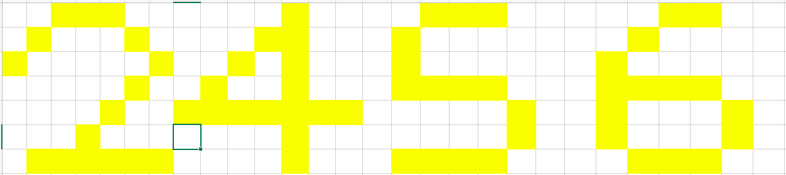

## 智能核心系列之降维

任何转载或传播均请邮件联系sinyeratlantis@gmail.com请求许可，获得同意后方可转载或传播。

### 前言

[写此文档的原因，以链接形式伪隐藏。][1]

### 1. 智能科学的三大问题

受过心理学熏陶的我们都知道，人行事必定有其理由。降维也是一样，我们首先要知道为什么要提降维。

我们的目标是实现通用智能，理想目标是实现远超我们智能水平却按照我们指令行事的强人工智能。从零设计智能是困难且高度不确定的，我们很多创作也是一样，都是从现有的知识里模仿、优化、泛化、创新，所以设计智能，最简单就是模拟人类。

首先就是理解人类智能本质。我们从神经科学和心理学的积累中已经给出了一些结论，用于指明人类智能的本质：

- 从祖母细胞相关的知识我们推断了智能的信息输入形式，那就是空间变化和时间变化的刺激，这是我们感知到的所有信息，包括所有触觉、视觉、听觉、嗅觉，在大脑皮层全部转化为空变时变的刺激。

  根据视觉系统初级对比度提取，我们可以得出空间变化（如不是纯色的图像）的刺激可通过对比提取简化信息。而时间信息我们从滞后-非滞后神经元对的存在可推测为时间对比度的提取。

- 重复听到的陌生词汇能最终在大脑产生和学习过的词汇相同的反应，这个实验证明了大脑通过重复学习并记忆了这个词汇。这个过程和信息提取往往是一起发生的。记忆使得大脑对熟悉的事物反应加快，而且记忆时序的关联性使得符号能代表具体的事物和过程。

- 丘脑决定了人绝大多数欲望，外界刺激传输到丘脑中，基因编码了丘脑对这些信息的反馈方式，对某些信息发出愉悦信号，反之发出恐惧等负面信号。这些信号会决定人对所处状态是否满意。在这种刺激下，人尝试行为，不断理解了自己的行为，试探执行行为能否带来更好的状态，并对尝试进行记忆。记忆中存在的可直接复现。

从上述可以看出，人的智能真的很肤浅，没有多么高不可攀，但要实现一个高智能的机器，还有数不尽的理论和工程问题。以上三点，我们可以总结为：

- 降维：将量级过大的信息降维至可接受记忆的程度，包括空间信息降维和时间信息降维。
- 记忆：降维得到的特征被记忆，其中，联系体现在记忆时间信息的特征上，如同时出现的苹果和"苹果"一词能被联系。
- 决策：能认知并理解自己的动作，并能依据记忆预测然后执行动作满足自身欲望。

那么，智能科学的三大问题即是：如何压缩信息、如何记忆信息、如何依记忆和欲望决策。

### 2. 智能科学里的降维

降维(Dimensionality reduction)，根据维基的定义：

> dimensionality reduction or dimension reduction is the process of reducing the number of random variables under consideration by obtaining a set of principal variables. It can be divided into feature selection and feature extraction.

即，降维就是根据主要变量筛选随机变量的过程，最关键在于特征选择和特征提取。其中特征选择即对应选择主要变量，特征提取即对应筛选随机变量。

这是降维在机器学习领域的定义。我们从智能的角度思考一下，降维的核心目的是什么？降维做的事是抛弃不重要的信息，留下关键信息，而信息之所以关键的原因在于我们存在其他这样的信息或可能性需要将其区分或辨识。不严谨地说，降维就是为了便于分类。

经典降维算法主成分分析或许能帮助我们更好理解这点：

上图散点近似与x轴成45°排列，PCA做的也就是将这些点沿某个方向压缩成一条直线上的点，即将2维降为1维。直观上我们马上就发现沿约45°压缩应该是最好的，因为我们本能地就想到了希望压缩了之后还能区分这些点，这也就是PCA最大化方差的理由。

实际上我们已经发现，区分性是至关重要的。条件允许时我们甚至不希望降维，因为我们希望将所有点都区分开来，如随机的散点怎么降维都会丢失可分信息。这个时候，点的坐标就是我们关注的特征，对区分重要的坐标信息也就是关键信息，不重要的也就是降维目标了。

从这点上看，PCA可以说是完美的算法，它会逐级舍弃最不重要信息，保留我们区分的最低要求。然而，现实情况当然是远比理想要复杂得多。

如何选择特征恐怕是降维里最大的问题。坐标是否是我们关心的特征，现实情况里是否能取出类似于坐标的信息。回到我们的智能问题，视觉的图像视频，听觉的音频，触觉的变化刺激，这些怎么降维，怎么提取出有用的信息？显然，可区分性是我们选择特征的核心标准。

对智能而言，我们需要区分什么？人脑降维似乎是个逐级压缩的过程，我们开始能区分任何刺激上的不同，然后我们开始忽略光强和声压，更关注具体模式，然后我们开始忘记具体模式，只记得几个关键特征，这几个特征最终帮助我们区分了猫和狗，前一级的特征能帮助我们区分大卫家的猫和汤姆家的猫。形状上的不同似乎是区分的特征，但PCA却不能告诉我们猫和狗的形状究竟有什么不同，也不能告诉我们为什么1.2倍速播放的音乐实际和1倍速播放的音乐是同一首歌。仿佛这里的特征既是时间可变的又是空间可变的。无法做好特征选择，那么数据分析的算法将永远不能在智能上产生真正的意义。这也就是我认为的人脑智能的核心。

不知道如何选取特征来降维图像的情况下，神经网络给了一种办法。比如卷积神经网络做图像分类任务，如CIFAR-10分类任务，其实可视为将一个32x32x3的张量强行逐级计算降维成了一个长度为10的one-hot向量。降维到一点实际上就直接完成了聚类，如果特征正确，那么猫和狗打不打标签其实不重要，只要能区分即可。所以我们给出的核心监督信息应该就是期望降维到最后的一点。通过给出我们期望的降维结果来使网络去学习我们人类习得的区分特征。当然，如果对人而言聚类完猫狗后专家给猫狗打上标签，聚类的错误例子定然会让人类修正特征选择，这就将是我们下个主题探讨的内容了。

Goodfellow在花书里曾表示，监督和无监督算法之间的区别没有规范严格的定义，因为没有客观的判断来区分监督者提供的值是特征还是目标，经典的无监督学习任务是找到数据的最佳表示。这就说明降维所覆盖的范围可能远比我们想象中的深远，如上述例子，我们区分的监督学习，或许就只是利用监督信息学习得到降维需要依据的特征表示。这个特征表示不是凭空出现的，如果我们能知道人类究竟是怎样得到这个特征表示的，那么我们将无需通过监督信息学习表示。

现在，我们想知道的，就是人类是怎样在没有任何监督信息的情况下也能区分石头树木动物和歌曲的。如何区分才是降维的核心问题。

### 3. 现有降维算法简介

主流的降维算法：

- 主成分分析（PCA）

  用于维数降低的主要线性技术，以最大化低维表示中数据方差的方式执行数据到较低维空间的线性映射。实践中首先计算数据的协方差矩阵（有时是相关矩阵），然后计算该矩阵上的特征向量。对应于最大特征值（主成分）的特征向量可用于重建原始数据的主要方差。

- 非负矩阵分解（NMF）

  NMF将非负矩阵分解为两个非负矩阵的乘积，通过乘积矩阵维度可能远比原矩阵维度低的属性降维。这是一种在只有在非负信号的领域中常用的降维方法。

- 核PCA

  使用核技巧，使得PCA扩展到非线性变换。

- 基于图的核PCA

  首先是流形学习，包括等度量映射（Isomap）、局部线性嵌入（LLE）、拉普拉斯特征映射（LE）和切空间分析等方法。这些方法使用保留数据本地属性的成本函数构造低维数据表示，并且可被视为基于图的核PCA。

  有些方法不定义固定的核，而是尝试使用半定规划来学习核。这种技术最突出的例子是最大方差展开（MVU）。MVU的核心思想是精确保留内积空间中最近邻点之间的所有成对距离，同时最大化不是最近邻点之间的距离。

  邻域保留的另一种方法是通过最小化成本函数来度量输入输出空间中的距离差异，如经典的多维缩放（MDS）、Isomap、扩散映射、t分布邻域嵌入（t-SNE）、和曲线成分分析。

- 线性判别分析（LDA）及广义判别分析（GDA）

  线性判别分析（LDA）是Fisher线性判别式的推广，用于找到表征或分离多类对象特征的线性组合。GDA使用核函数运算处理非线性判别分析。

- 自编码器

  自编码器可用于学习非线性编码函数以及从编码到原始表示的反函数。

### 4. 主成分分析与非负矩阵分解

在进入智能科学的降维算法前，我们先简单讲解下机器学习里经典的两个降维算法：主成分分析和非负矩阵分解，另外简单提下深度学习里的自编码器。

####  4.1 主成分分析

我们可以将 PCA 视为学习数据表示的无监督学习算法。PCA 学习一种比原始输入维数更低的表示，它也学习了一种元素之间彼此没有线性相关的表示，这是学习表示中元素统计独立标准的第一步。要实现完全独立性，表示学习算法也必须去掉变量间的非线性关系。

PCA的数学定义是一个正交化的线性变换。把数据变换到一个新的坐标系统中，使得数据的任何投影的第一大方差在第一个坐标（称为第一主成分）上，第二大方差在第二个坐标（第二主成分）上，依次类推。通常，为了确保第一主成分描述的是最大方差的方向，我们会使用减去平均值法进行主成分分析。如果不执行减法，第一主成分有可能或多或少的对应于数据的平均值。

算法有两种，一种是求解样本方差矩阵，一种是直接求中心化矩阵的奇异值分解。两种算法是等效的，通过列正交、正交、对角等性质可证。本质是令数据投影方差最大，通过拉格朗日乘子法求解。

#### 4.2 非负矩阵分解

非负矩阵分解是多变量分析和线性代数中的一组算法，其中矩阵V通常被分解为两个矩阵W和H ，三个矩阵都具有无负面元素的属性。其中W矩阵为特征矩阵，相当于从原矩阵V中抽取出来的特征 ，H矩阵为系数矩阵。 当矩阵相乘时，特征矩阵的维数可能明显低于原矩阵的维数，正是这个属性构成了NMF的基础。

算法采取Lee和Seung的乘法更新规则，矩阵分解优化目标为最小化W矩阵H矩阵的乘积和原始矩阵之间的差别，可以采取欧几里得距离或KL散度衡量。

这种算法是次优的，因为它们仅保证找到局部最小值，而不是成本函数的全局最小值。将来也不太可能采用可证明的最优算法，因为已经证明该问题包含了已知为NP完全的k均值聚类问题。但是，与许多其他数据挖掘应用程序一样，局部最小值仍可能证明是有用的。

#### 4.3 简单总结

虽然我对传统降维算法这部分不算熟悉，但从PCA和NMF的角度看，这两种算法都没有涉及到前期的特征选择，而是直接将图像数据拼接成向量进行处理。在这一点上，我们之后还会咨询熟悉这部分知识的人，确定是否传统降维算法处理图像时均不涉及前期的特征选择。

### 5. 智能启发的降维算法

#### 5.1 为什么我们要提出这个课题（目的）

图像的分类从来就不是从数学起源的，我们生而可以区分模式、学习概念、给不同模式打上标签，这就证明我们的模式区分能力是强生物性的。数学是尝试去拟合我们生理上的分类标准，单纯用传统数学观点去尝试解释生物学的东西无论再优雅看似再合理的证明，其根基都是毫无合理性可言的。说到底整个数学体系都是建立在我们的智能基础上的，如果我们不能分辨我们观察的世界中的距离，那么所有基于距离的数学系统将毫无意义，也不会诞生。

因为我们能分辨距离，所以对于特征就是点的分布的数据分析算法才大行其道。然而对于图像，我们显然不单单分辨的只有距离了。这也是为什么卷积网络需要靠着我们先天就能区分的标注去学习我们脑中的特征表示。数学已无力直接处理，只能尝试不损失信息地依赖我们给的结论去拟合我们过程中的表示。

这个表示真是黑盒吗，我们通过拟合学习到的中间层表示或许给了我们一些启发。可视化CNN时我们发现很多都是色彩对比信息、边缘拐角信息、局部模式信息。这说明我们脑中的分类很有可能就是依赖这些特征表示，为何我们不能模拟人生理上的处理方式直接得到这些表示呢？

生物学证据强烈地支持了我们上述的观点，包括我们的神经节细胞输出、初级视皮层简单细胞、复杂细胞、下颞叶皮层（IT区）证明了我们偏好边缘和复杂模式，而且生理学证据甚至还提供了我们识别时序模式的生理学基础。我们是否能依据我们的生理学证据，设计我们人脑真正的特征识别算法，这就是本文档的核心内容。

#### 5.2 我们已做的尝试

关于生理学证据我们已在《视觉学习系统的神经设计原则》文档中详细阐述了，结合文档中的证据，我们设计了视觉区分的智能算法，本质是降维，目的是将高维的模式信息降维到稀疏易区分的神经元响应中。所有尝试的具体内容已在公开分享于Sinyer个人网站的[Intelligence Related][2]类别中。

#### 5.3 未来我们的工作分析

降维部分我们期望最后能实现的效果是作为记忆与联系的先前阶段，使无监督的数据输入具备区分不同模式的能力，并且有多级的区分度。然后与记忆阶段结合最终实现video caption，能够理解视频场景中的时序过程。

[1]: https://sinyeratlantis.github.io/        "这是智能核心系列文档的第一作，也是起始之作，我将尽全力将这篇文档写好，既是对思想还不成熟、对尝试着完成一项铭刻宇宙的伟大事业却毫无意识、对一直自卑而懒散的自己前一阶段花费大量时间整理心情和方向所得的成果总结，也是对下一阶段投身到这项令人无比激动的事业中的准备。这篇文档也是我为还在萌芽阶段但却是我最为珍视的Atlantis通用智能研究组单纯、可爱、自信的成员们写的未来导向和决心表示。风雨同舟，砥砺前行。"

[2]: https://sinyeratlantis.github.io/category/ir.html

