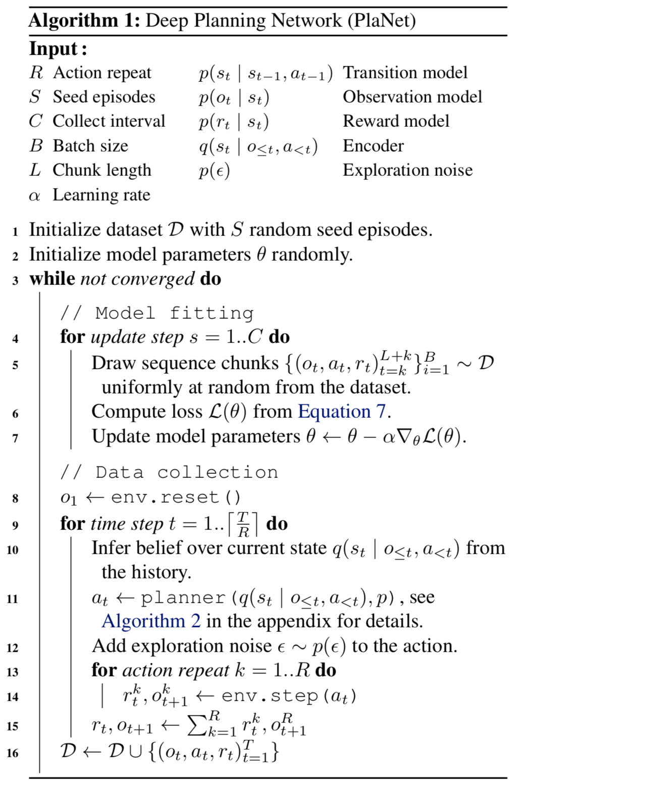
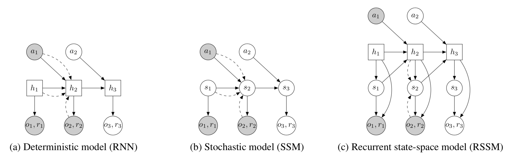
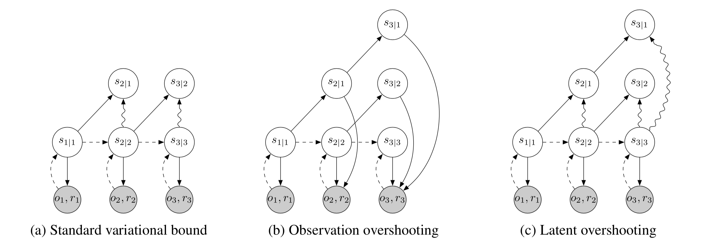

## 从像素中学习隐藏动态以执行规划

Learning Latent Dynamics for Planning from Pixels

Danijar Hafner - DeepMind

### 摘要

对于具有已知环境动态的控制任务，规划非常成功。为了在未知环境中利用规划，代理需要从与世界的交互中学习动态。然而，对于规划而言足够准确的学习模型一直是一个长期挑战，尤其是在基于图像的领域。我们提出了深度规划网络（PlaNet），这是一个纯模型代理，可以从图像中学习环境动态，并通过隐藏空间中的快速在线规划选择行动。为了实现高性能，动态模型必须准确预测多个时间步的前方奖励。我们使用具有确定性和随机转移分量的隐藏动态模型以及我们称之为隐藏超调的多步变分推理目标来解决这个问题。仅使用像素观察，我们的代理通过接触动态、部分可观察性和稀疏奖励来解决连续控制任务，这超出了先前通过学习模型进行规划所解决的任务的难度。 PlaNet使用的回合数量大大减少，最终性能接近于强大的无模型算法，有时甚至更高。

### 1. 介绍

规划是一种自然而有效的方法，可以解决具有已知动态的决策问题，例如游戏和模拟机器人控制。要在未知环境中进行规划，代理需要从经验中学习动态。足够准确的学习动态模型是一项长期的挑战。主要困难包括模型不准确、累积多步预测的错误、未能捕获多个可能的未来、以及训练分布之外的过度预测。

使用学习模型进行规划与无模型强化学习相比具有多种优势。首先，基于模型的规划可以提高数据效率，因为它可以利用更丰富的训练信号，并且不需要通过Bellman备份传播奖励。此外，正如Silver所示，规划通过增加搜索动作的计算预算来实现提高性能的承诺。最后，学习动态可以独立于任何特定任务，因此有可能很好地迁移到环境中的其他任务。

最近的工作在学习简单的低维环境的动态方面显示出了前景。然而，这些方法通常假设访问世界的基础状态和奖励函数，这在实践中可能是不可用的。在高维环境中，我们希望在紧凑的隐藏空间中学习动态，以实现快速规划。这种隐藏模型的成功仅限于简单的任务，例如平衡车轮和控制2连杆臂的密集奖励。

在本文中，我们提出了深度规划网络（PlaNet），这是一种基于模型的代理，可以从像素中学习环境动态，并通过在紧凑的隐藏空间中进行在线规划来选择行动。 为了学习动态，我们使用具有随机和确定性分量的转移模型，并使用鼓励多步预测的广义变分目标对其进行训练。 PlaNet通过比使用学习模型进行规划而难以解决的像素来解决连续控制任务。

这项工作的主要贡献概括如下：

- 规划于隐藏的空间。我们通过学习动态模型并在其隐藏空间中有效规划，从DeepMind控制套件中解决各种任务，如图1所示。 我们的代理在最终性能方面大大优于无模型A3C，在某些情况下优于D4PG算法，且具有平均50倍效率的环境交互和类似的计算时间。
- 循环状态空间模型。我们设计了具有确定性和随机成分的隐藏动态模型。 我们的实验表明，这两个组件对于高规划性能至关重要。
- 隐藏超调。我们将标准变分界限推广到包括多步预测。 仅使用隐藏空间中的项会产生快速有效的正则化器，可改善长期预测并与任何隐藏序列模型兼容。

### 2. 隐藏空间规划
为了通过规划解决未知环境，我们需要根据经验对环境动态进行建模。 PlaNet通过在收集的数据上规划和训练动态模型来迭代地收集数据。 在本节中，我们介绍了环境符号，并描述了基于模型的代理的一般实现。 在本节中，我们假设访问学习动态模型。 我们分别在第3节和第4节详细介绍了该模型的设计和训练目标。

##### 问题设置
由于个别图像观察通常不会揭示环境的完整状态，因此我们考虑部分可观察的马尔可夫决策过程（POMDP）。 我们定义了离散时间步长$t$，隐藏状态$s_t$，图像观察$o_t$，连续动作矢量和标量奖励$r_t$，遵循随机动态：

- 转移函数：$s _ { t } \sim \mathrm { p } \left( s _ { t } | s _ { t - 1 } , a _ { t - 1 } \right)$
- 观察函数：$o _ { t } \sim \mathrm { p } \left( o _ { t } | s _ { t } \right)$
- 奖励函数：$r _ { t } \sim \mathrm { p } \left( r _ { t } | s _ { t } \right)$
- 策略：$a _ { t } \sim \mathrm { p } \left( a _ { t } | o _{\leq t} , a_{< t} \right)$

我们假设一个固定的初始状态$s_0$而不失一般性。 目标是实施一个策略 $\mathrm { p } \left( a _ { t } | o _{\leq t} , a_{< t} \right)$，最大化预期的奖励总和$\mathrm { E } _ { \mathrm { p } } \left[ \sum _ { \tau = t + 1 } ^ { T } \mathrm { p } \left( r _ { \tau } | s _ { \tau } \right) \right]$，其中期望超过环境和策略的分布。

##### 基于模型的规划
PlaNet从先前经历过的回合中学习转移模型$p \left( s _ { t } | s _ { t - 1 } , a _ { t - 1 } \right)$、观察模型$p \left( o _ { t } | s _ { t } \right)$和奖励模型$p \left( r _ { t } | s _ { t } \right)$（注意模型的斜体字母与直立真实动态的字母）。 观察模型提供训练信号但不用于规划。 我们还学习编码器$q \left( s _ { t } | o_{ \leq t} , a_{ < t} \right)$以使用滤波从历史中推断出对当前隐藏状态的近似信念。 鉴于这些组件，我们将策略实施为规划算法，以搜索未来操作的最佳顺序。 我们使用模型预测控制来允许代理根据新的观察结果调整其规划，这意味着我们在每个步骤重新规划。 与无模型和混合强化学习算法相比，我们不使用策略网络。

##### 经验收集
由于代理最初可能不会访问环境的所有部分，因此我们需要迭代地收集新经验并改进动态模型。 我们通过使用部分训练的模型进行规划来实现，如算法1所示。从随机动作下收集的少量$S$种子回合开始，我们训练模型并在每个$C$更新步骤中向数据集添加一个附加回合。 收集数据集的回合时，我们会在动作中添加小的高斯探测噪声。 为了减少规划范围并为模型提供更清晰的学习信号，我们重复每个动作$R$次，这在强化学习中很常见。

规划算法我们使用交叉熵方法（CEM）在模型下搜索最佳动作序列，如算法2中所述。我们决定使用该算法，因为它具有鲁棒性，并且因为它在给定真实动态时解决了所有考虑的任务。 CEM是一种基于数量的优化算法，它推导出最大化目标的动作序列分布。如附录中的算法2所详述，我们在最优动作序列$a _ { t : t + H } \sim \operatorname { Normal } \left( \mu _ { t : t + H } , \sigma _ { t : t + H } ^ { 2 } \mathbb { I } \right)$ 上初始化时间相关的对角高斯信念，其中$t$是代理的当前时间步长，$H$是规划范围的长度。从零均值和单位方差开始，我们重复采样$J$个候选动作序列，在模型下评估它们，并将信念重新拟合到前$K$个动作序列。在迭代之后，规划器返回当前时间步长的信念的平均值$μ_t$。重要的是，在接收到下一个观察结果后，对动作序列的信念再次从零均值和单位方差开始，以避免局部最优。

为了评估学习模型下的候选动作序列，我们从当前状态信念开始采样状态轨迹，并对沿序列预测的平均奖励求和。 由于我们使用基于总体的优化器，我们发现每个动作序列考虑单个轨迹就足够了，因此将计算预算集中在评估大量不同序列上。 因为奖励被建模为隐藏状态的函数，所以规划可以纯粹在隐藏空间中操作而不生成图像，这允许快速评估大批动作序列。 下一节将介绍规划使用的隐藏动态模型。

### 3. 循环状态空间模型

对于规划，我们需要在代理的每个时间步骤评估数千个动作序列。 因此，我们使用复现状态空间模型（RSSM），它可以纯粹在隐藏空间中预测前向，类似于最近提出的模型。 该模型可以被认为是非线性卡尔曼滤波器或顺序VAE。 我们强调了两个可以指导动态模型未来设计的发现，而不是与先前的体系结构进行广泛的比较：我们的实验表明，转移模型中的随机和确定性路径对于成功规划至关重要。 在本节中，我们对读者讲述隐藏的状态空间模型，然后描述我们的动态模型。

##### 隐藏规划

我们考虑序列$\left\{ o _ { t } , a _ { t } , r _ { t } \right\} _ { t = 1 } ^ { T }$，离散时间步长$t$，高维图像观察$o_t$，连续动作矢量和标量奖励$r_t$。 典型的隐藏状态空间模型如图2b所示，类似于部分可观察马尔可夫决策过程的结构。 它使用隐藏状态序列$\left\{ s _ { t } \right\} _ { t = 1 } ^ { T }$来定义图像和奖励的生成过程：

- 转移模型：$s _ { t } \sim p \left( s _ { t } | s _ { t - 1 } , a _ { t - 1 } \right)$
- 观察模型：$o _ { t } \sim p \left( o _ { t } | s _ { t } \right)$
- 奖励模型：$r _ { t } \sim p \left( r _ { t } | s _ { t } \right)$

图2：隐藏动态模型设计。 在此示例中，模型观察前两个时间步骤并预测第三个时间步骤。 圆圈代表随机变量和平方确定性变量。 实线表示生成过程，虚线表示推理模型。 （a）递归神经网络中的转换纯粹是确定性的。 这可以防止模型捕获多个未来，并使规划可以轻松利用不准确性。 （b）状态空间模型中的转移纯粹是随机的。 这使得难以记住多个时间步骤的信息。 （c）我们将状态分为随机和确定性部分，使模型能够有力地学习预测多个未来状态。

我们假设一个固定的初始状态$s_0$而不失一般性。 转换模型是高斯的，其均值和方差由前馈神经网络参数化，观测模型是高斯的，平均参数化为反卷积神经网络和同一性协方差，而奖励模型是标量高斯，其均值和单位方差由前向神经网络参数化。 注意，具有单位方差的高斯分布下的对数似然等于均方误差（忽略常数）。

##### 变分编码器

由于模型是非线性的，我们无法直接计算参数学习所需的状态后验。 相反，我们使用编码器$q \left( s _ { 1 : T } |\right. o _ { 1 : T } , a _ { 1 : T } ) = \prod _ { t = 1 } ^ { T } q \left( s _ { t } | s _ { t - 1 } , a _ { t - 1 } , o _ { t } \right)$从过去的观察和动作推断近似状态后验，其中$q \left( s _ { t } | s _ { t - 1 } , a _ { t - 1 } , o _ { t } \right)$是对角高斯，其中均值和方差由卷积神经网络参数化，随后是前馈神经网络。由于我们最终对使用该模型进行规划感兴趣，我们使用过去后验的过滤后验，但是在训练期间也可以使用完全平滑后验。

##### 训练目标
使用编码器，我们在数据对数似然上构造变分界。 为简单起见，我们编写损失仅用于预测观察结果，奖励损失也同样。 使用Jensen不等式得到的变分界是：

$\ln p \left( o _ { 1 : T } | a _ { 1 : T } \right) \triangleq \ln \int \prod _ { t } p \left( s _ { t } | s _ { t - 1 } , a _ { t - 1 } \right) p \left( o _ { t } | s _ { t } \right) d s _ { 1 : T }$

$\geq \sum _ { t = 1 } ^ { T } ( \mathrm { E } _ { q \left( s _ { t } | o_{ \leq t} , a_{ < t} \right) } \left[ \ln p \left( o _ { t } | s _ { t } \right) \right] - \mathrm { E } _ { q \left( s _ { t-1 } | o_{ \leq t-1} , a_{ < t-1} \right) }\left[ \mathrm { KL } \left[ q \left( s _ { t } | o_{ \leq t} , a _ { < t } \right) \| p \left( s _ { t } | s _ { t - 1 } , a _ { t - 1 } \right) \right] \right] )$

有关推导，请参阅附录中的公式8。 使用单个重新参数化样本估计外部期望产生了非线性隐藏变量模型中的推理和学习的有效目标，其可以使用梯度上升来优化。

##### 确定性路径

尽管其一般性，纯粹的随机转换使得转换模型难以可靠地记住多个时间步骤的信息。 理论上，对于某些状态组件，此模型可以学习将方差设置为零，但优化过程可能找不到此解决方案。 这促使包括确定性的激活向量序列$\left\{ h _ { t } \right\} _ { t = 1 } ^ { T }$，其允许模型不仅确定性地访问最后状态而且访问所有先前状态。 我们使用这样一个模型，如图2c所示，我们命名为循环状态空间模型（RSSM）：

- 确定性状态模型：$h _ { t } = f \left( h _ { t - 1 } , s _ { t - 1 } , a _ { t - 1 } \right)$
- 随机性状态模型：$s _ { t } \sim p \left( s _ { t } | h _ { t } \right)$
- 观察模型：$o _ { t } \sim p \left( o _ { t } | h _ { t } , s _ { t } \right)$
- 奖励模型：$r _ { t } \sim p \left( r _ { t } | h _ { t } , s _ { t } \right)$

其中$f \left( h _ { t - 1 } , s _ { t - 1 } , a _ { t - 1 } \right)$被实现为递归神经网络（RNN）。 直观地，我们可以将该模型理解为将状态分为随机部分$s_t$和确定性部分$h_t$，其取决于通过RNN的前一时间步的随机和确定性部分。我们使用编码器$q \left( s _ { 1 : T } | o _ { 1 : T } , a _ { 1 : T } \right) = \prod _ { t = 1 } ^ { T } q \left( s _ { t } | h _ { t } , o _ { t } \right)$来参数化近似状态后验。 重要的是，有关观测的所有信息必须通过编码器的采样步骤，以避免出现从输入到重建的确定性捷径。

##### 全局优先
可以使用相同的损失函数训练模型（公式3）。 此外，我们先添加一个固定的全局，以防止后验者在近乎确定的环境中崩溃。 这减轻了对最初小的训练数据集的过度拟合并且使得状态信念（因为后验和时间先验都是学习的，它们可以在隐藏的空间中偏移）。 全局先验从标准高斯的每个后面添加额外的KL-发散损失项。 对此的另一种解释是将每个时间步的先验定义为学习时间先验和全局固定先验的乘积。 在下一节中，我们确定隐藏序列模型的标准目标的局限性，并提出对其进行推广以改进长期预测。

### 4. 隐藏的超调
在上一节中，我们推导出隐藏序列模型中学习和推理的典型变分界限（公式3）。 如图3a所示，该目标函数包含观察的重建项和近似后验的KL-发散正则化器。 这个目标的局限性在于，转移函数$p \left( s _ { t } | s _ { t - 1 } , a _ { t - 1 } \right)$仅通过KL-发散正则化器进行一步预测训练：梯度流过$p \left( s _ { t } | s _ { t - 1 } , a _ { t - 1 } \right)$直接进入$q \left( s _ { t - 1 } \right)$但从不遍历一系列多个$p \left( s _ { t } | s _ { t - 1 } , a _ { t - 1 } \right)$。 在本节中，我们将这种变化约束推广到隐藏超调，它可以训练隐藏空间中的所有多步预测。

图3：展开方案。对于取决于直到时间$j$的观察的时间$i$的状态，标签$s _ { i  | j}$是不足的。 指向阴影圆圈的箭头表示对数似然丢失项，波浪箭头表示KL-分歧损失项。 （a）标准变分目标在每一步解码后验以计算重建损失。 它还在每一步的前后放置一个KL，它训练一步预测的转移函数。 （b）观察超调解码所有多步骤预测以应用额外的重建损失，这在图像域中通常太昂贵。 （c）隐藏超调预测所有多步骤先验。 这些状态信念在隐藏空间中针对其相应的后验训练，以鼓励准确的多步预测。

##### 容量有限
如果我们可以训练我们的模型进行完美的一步预测，那么它也会做出完美的多步预测，所以这不会成为问题。 然而，当使用具有有限容量和受限分布族的模型时，仅在一步预测上训练模型，直到收敛一般不与多步预测中最佳的模型一致。 对于成功的规划，我们需要准确的多步骤预测。 因此，我们从Amos和早期相关的想法中获取灵感，并在所有距离的多步预测中训练模型。 我们为隐藏序列模型开发了这个想法，表明可以通过隐藏空间的损失来改善多步骤预测，而不必生成额外的图像。

##### 多步预测
我们首先将标准变分界（方程式3）从训练一步预测推广到训练固定距离d的多步预测。 为了便于表示，我们在此处的条件集中省略了操作，$s_t$上的每个分布都以$a_{<t}$为条件。 我们首先定义多步预测，通过重复应用转换模型并整合中间状态来计算：

$p \left( s _ { t } | s _ { t - d } \right) \triangleq \int \prod _ { \tau = t - d + 1 } ^ { t } p \left( s _ { \tau } | s _ { \tau - 1 } \right) d s _ { t - d + 1 : t - 1 }$

$= \mathrm { E } _ { p \left( s _ { t - 1 } | s _ { t - d } \right) } \left[ p \left( s _ { t } | s _ { t - 1 } \right) \right]$

情况$d = 1$恢复原始模型中使用的一步转换。 给定多步预测的这种定义，我们将方程3推广到多步预测分布$p_d$的变分界：

$\ln p _ { d } \left( o _ { 1 : T } \right) \triangleq \ln \int \prod _ { t = 1 } ^ { T } p \left( s _ { t } | s _ { t - d } \right) p \left( o _ { t } | s _ { t } \right) d s _ { 1 : T }$

。。。反正你看不懂，见论文。

有关推导，请参阅附录中的公式9。 最大化此目标训练多步骤预测分布。 这反映了这样一个事实，即在规划过程中，模型无需访问所有前面的观察结果即可进行预测。

我们推测方程式6也是基于数据处理不等式的$\ln p \left( o _ { 1 : T } \right)$的下界。 由于隐藏状态序列是马尔可夫序列，因此对于$d \geq 1$，我们得到$\mathrm { I } \left( s _ { t } ; s _ { t - d } \right) \leq \mathrm { I } \left( s _ { t } ; s _ { t - 1 } \right)$，因此$\mathrm { E } \left[ \ln p _ { d } \left( o _ { 1 : T } \right) \right] \leq \mathrm { E } \left[ \ln p \left( o _ { 1 : T } \right) \right]$。 因此，多步预测分布的每个界限也是对数据集期望的一步预测分布的约束。 有关细节，请参阅附录中的公式10。 在下一段中，我们减轻了特定$p_d$仅训练一个距离的预测并达到我们的最终目标的限制。

##### 隐藏的超调
我们引入了给定距离$d$的预测界限。 但是，对于规划，我们需要准确的预测，不仅是固定距离，而且是所有距离到规划范围的距离。 我们引入了隐藏的超调，这是隐藏序列模型的一个目标函数，它推广了标准变分界（方程式3），在所有距离$1≤d≤D$的多步预测中训练模型：

$\frac { 1 } { D } \sum _ { d = 1 } ^ { D } \ln p _ { d } \left( o _ { 1 : T } \right) \geq \sum _ { t = 1 } ^ { T } ($

。。。反正你看不懂，见论文。

隐藏的超调可以被解释为隐藏空间中的正则化器，其促进一步和多步预测之间的一致性，我们知道这应该与数据集的期望相等。 我们包括与β-VAE类似的加权因子$\left\{ \beta _ { d } \right\} _ { d = 1 } ^ { D }$。 虽然我们将所有$β> 1$设置为相同的值以简化，但可以选择它们以使模型更多地关注长期或短期预测。 在实践中，我们停止后验分布的梯度以超越距离$d> 1$，以便多步预测被训练到知情的后代，但不是相反的方式。 公式7是我们用来训练代理动态模型的最终目标函数。

### 5. 实验
我们从像素中评估了六个连续控制任务的PlaNet。 我们探索了代理的多个设计轴：动态模型中的随机和确定性路径、隐藏的超调目标和在线经验收集。 我们参考超级参数的附录。 除了动作重复之外，我们对所有任务使用相同的超参数。 在第五十回合中，PlaNet优于A3C，并且实现了与顶级无模型算法D4PG类似的性能。 单个Nvidia V100 GPU上的1天训练时间与D4PG相当。 我们的实现使用TensorFlow概率。 请访问https://danijar.com/planet以访问受过训练的代理的代码和视频。

对于我们的评估，我们考虑了DeepMind控制套件的六个基于图像的连续控制任务，如图1所示。这些环境提供了质量上不同的挑战。 cartpole swingup任务需要很长的规划范围，并且当它在视野之外时记住推车，手指旋转任务包括手指和物体之间的接触动态，猎豹任务展示更大的状态和动作空间，杯子任务仅具有球被捕获时的稀疏奖励，并且步行者具有挑战性，因为机器人首先必须站起来然后行走，导致与地面的碰撞难以预测。 在所有任务中，唯一的观察是尺寸为64×64×3像素的第三人称相机图像。

##### 与无模型方法的比较

图4比较了PlaNet与Tassa报告的无模型算法的性能。 在500回合中，PlaNet在所有任务上都优于从本体感受状态训练的策略梯度方法A3C，共计100,000回合。 在2000回合之后，它实现了与D4PG类似的性能，从图像训练了100,000回合，除了手指任务。 在猎豹的运行任务中，PlaNet超过了D4PG的最终性能，相对提升了19％。 我们参考表1的数值结果，其中还包括CEM规划的性能以及模拟器的真实动态。

##### 模型设计
图4还比较了动态模型的设计选择。 我们使用我们的循环状态空间模型（RSSM）以及纯粹确定性GRU和纯粹随机状态空间模型（SSM）的版本来训练PlaNet。 我们观察到转移函数中随机和确定性元素对所有任务的重要性。 随机成分可能有所帮助，因为由于初始状态的部分可观察性，任务从代理的角度来看是随机的。 噪声还可能为规划目标增加安全余量，从而产生更强大的动作序列。 确定性部分允许模型记住许多时间步骤的信息，甚至可以说比随机性更重要，如果没有它，代理就不会学习。

##### 代理设计
图5比较了PlaNet与隐藏超调到具有标准变分目标的版本，以及固定随机数据集而不是在线收集经验的版本。 我们观察到在线数据收集有助于所有任务，并且对于手指和步行者任务是必需的。 成功规划步行者和杯子任务需要隐藏的超调，杯子任务中的稀疏奖励要求对许多时间步骤进行准确的预测。 它还减慢了手指任务的初始学习速度，但增加了cartpole平衡和猎豹任务的最终表现。

##### 一个代理所有任务
附录中的图7显示了对所有六个任务进行过训练的单个代理的性能。 代理不知道它面临哪个任务，它需要从图像观察中推断出这一点。 我们使用未使用的元素填充动作空间以使它们兼容，并使算法1适应每6个更新步骤收集每个任务的一个回合。 我们使用与上述主要实验相同的超参数。 与单独训练的代理相比，代理在任务上达到相同的平均性能。 虽然杯子任务和更轻松的推车任务的学习速度变慢，但是对于步行者的艰巨任务而言，它得到了显着改善。 这表明，无论概念上不同的视觉效果如何，使用基于模型的强化学习都可以实现这些任务之间的正向转移。

### 6. 相关工作
以前基于模型的强化学习的工作主要集中在低维状态空间的规划，结合了基于模型和无模型方法的优点，以及无需规划的纯视频预测。 附录E更详细地回顾了这些正交的研究方向。

相对较少的工作已经证明使用学习动态模型从像素成功规划。 机器人社区专注于视频预测模型，用于规划处理现实世界的视觉复杂性，并使用简单的抓取器解决任务，例如抓取或推动物体。 相比之下，我们专注于模拟环境，我们利用隐藏规划扩展到更大的状态和行动空间、更长的规划视野、以及稀疏的奖励任务。 E2C和RCE将图像嵌入到隐藏空间中，在那里他们学习局部线性隐藏转移并使用LQR规划动作。 这些方法平衡了模拟的车轮和控制双连杆臂的图像，但难以扩大规模。 我们提升了这些模型的马尔可夫假设，使我们的方法适用于部分可观察性，并在更具挑战性的环境中呈现结果，包括更长的规划视野、接触动态和稀疏奖励。

### 7. 讨论
我们介绍了PlaNet，一个基于模型的代理，它从图像观察中学习隐藏的动态模型，并通过在隐藏空间中快速规划来选择行动。为了实现准确的长期预测，我们设计了一个具有随机和确定性路径的模型，并使用我们提出的隐藏超调目标对其进行训练。我们展示了我们的代理在图像观察的几个连续控制任务中取得了成功，达到了与最佳无模型算法相当的性能，同时使用了50倍更少的回合和类似的训练时间。结果表明，学习图像域规划的隐藏动态模型是一种很有前景的方法。

未来工作的方向包括学习时间抽象而不是使用固定动作重复，可能通过分层模型。为了进一步提高最终效果，可以学习一种价值函数来估算超出规划范围的奖励总和。此外，探索基于梯度的规划可以提高代理的计算效率。我们的工作通过共享动态模型为多任务控制提供了一个起点。

