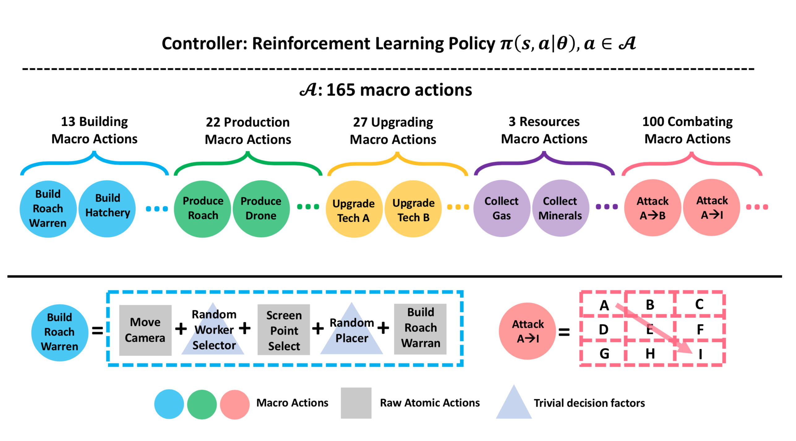
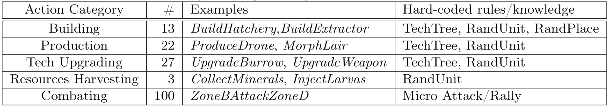
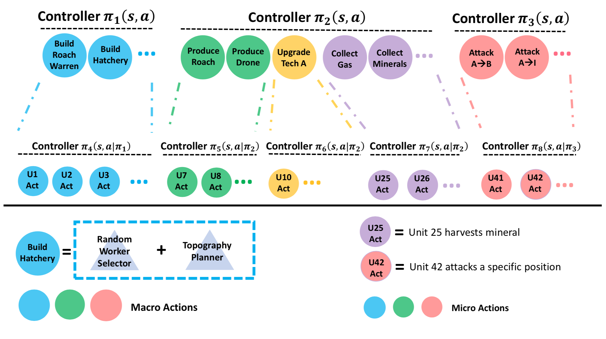
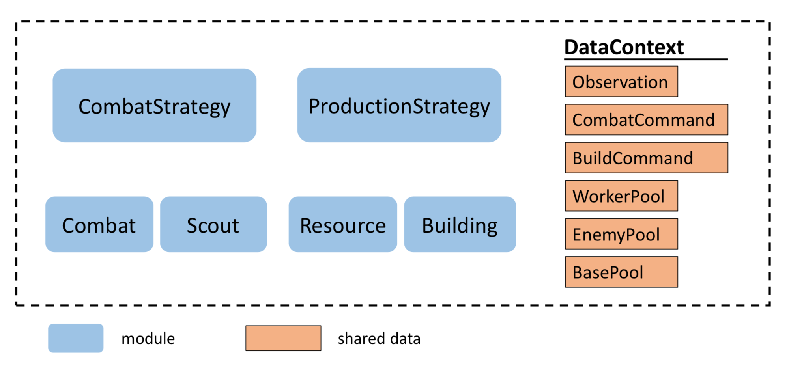
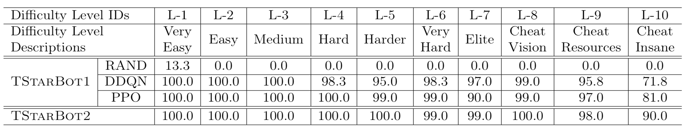
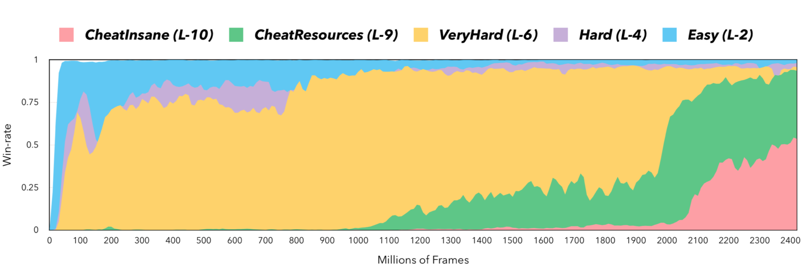
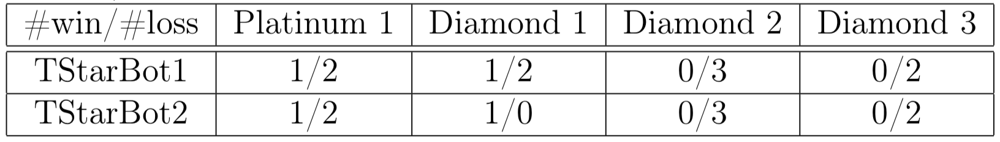

# TStarBots：在完整游戏中击败星际争霸II的作弊等级

TStarBots: Defeating the Cheating Level Builtin AI in StarCraft II in the Full Game

Peng Sun - Tencent AI Lab

## 摘要

星际争霸II（SC2）被广泛认为是最具挑战性的实时战略（RTS）游戏。潜在的挑战包括一个大的观察空间、一个巨大的（连续的和无限的）动作空间、部分观察、所有玩家的同步移动、以及局部决策的长期延迟奖励。为了推动人工智能研究的前沿，Deepmind和Blizzard联合开发了星际争霸II学习环境（SC2LE）作为复杂决策系统的测试平台。SC2LE提供了一些迷你游戏，如Move-To-Beacon、Collect-Mineral-Shards、和Defeat-Roaches，其中一些AI代理已达到人类职业玩家的性能水平。然而，对于完整的游戏，目前的AI代理仍远未达到人类专业级别的表现。为了弥补这一差距，我们在本文中提出了两个完整的游戏AI代理。 AI代理TStarBot1基于对平面动作结构的深度强化学习，而AI代理TStarBot2基于分层动作结构上的硬编码规则。 TStarBot1和TStarBot2都能够在完整游戏中击败内置AI代理从1级到10级（AbyssalReef地图上的1v1 Zerg-vs-Zerg游戏），注意到8级、9级和10级都是具有不公平优势的作弊代理，例如整个地图上的全视觉和资源丰富提升。据我们所知，这是第一个调查可以在星际争霸II完整游戏中击败内置AI的AI代理的公开工作。

## 1. 介绍

最近，深度学习和强化学习的结合导致基于机器的决策系统的重大突破，特别是对于计算机游戏。 基于深度强化学习的系统，无论是从头开始训练还是从预先训练的模型进行训练，都可以获取原始观察特征的输入并在广泛的应用中实现令人印象深刻的性能，包括棋盘游戏围棋、视频游戏（例如，Atari、第一人称射击游戏Doom和ViZDoom、Quake和DeepmindLab、Dota 2）、机器人视觉运动控制、机器人导航等。学习的策略或控制器可以令人惊讶地工作，并且在许多情况下甚至可以实现超人类性能。

然而，被广泛认为是最具挑战性的RTS游戏的星际争霸II仍然没有得到解决。在SC2中，人类玩家必须操纵数十到数百个单位用于多种目的，例如，收集两种类型的资源、扩展额外资源、升级技术、建立其他单位、派遣小队进行攻击或防御、对每个单位执行微观管理。Dota 2需要控制的单位总数最多为5（分别由5名玩家操纵），这是为什么SC2比Dota 2更具挑战性的一个重要的因素。图1显示了人类玩家使用的截图。对手的单位对玩家隐藏，除非他们处于由玩家控制的单位的观看范围内。玩家需要派出侦察部队来监视对手的战略。所有决定都必须实时做出。在设计AI代理方面，SC2涉及大型观察空间、巨大的动作空间、部分观察、所有玩家的同步移动以及本地决策的长期延迟奖励。所有这些因素都使SC2极具挑战性。为了推动人工智能研究的前沿，Deepmind和Blizzard联合开发了星际争霸II学习环境。 Deepmind最近的一些结果显示，他们的AI代理可以在一些迷你游戏中达到专业玩家的性能水平，例如，代理操纵海军陆战队员到达一个灯塔（MoveToBeacon）或操纵几个海军陆战队击败几个蟑螂（DefeatRoaches）等等。然而，对于完整的游戏，目前的AI代理仍远未达到人类专业级别的表现。

本文研究完整游戏的AI代理，为简单起见，我们将研究限制在以下设置：AbyssalReef地图上的1vs1 Zerg-vs-Zerg。 我们开发了两个AI代理：AI代理TStarBot1基于对平面操作的深度强化学习，而AI代理TStarBot2基于分层操作的规则控制器。 TStarBot1和TStarBot2都能够在完整游戏中击败内置AI代理从1级到10级，注意8级、9级和10级是作弊代理，具有不公平的优势，例如整个地图上的完整视觉和更丰富的资源。 值得一提的是，根据星际争霸II论坛的一些非正式讨论，10级内置人工智能估计是白金级钻石，相当于在战网的排名系统中前50％到30％的人类参与者。

AI代理TStarBot1基于“平面”动作建模，它采用平面动作结构并产生许多离散动作。这种设计使其能够立即用于任何采用离散动作作为输入的现成RL算法。 AI代理TStarBot2基于“深度”动作建模，它采用手动指定的动作层次结构。直观地说，“深度”建模可以更好地捕获动作依赖性。然而，由于需要用复杂分层RL的学习方法，因此训练变得更具挑战性。为了避免这个困难，我们在这项工作中简单地为TStarBot2采用了一个基于规则的控制器。

据我们所知，这是第一个调查可以在Starcraft II完整游戏中击败内置AI的AI代理的公开工作。代码将是开源的。我们希望所提出的框架将以几种可能的方式对未来的研究有益：

1. 成为混合系统的基线，其中可以包括越来越多的学习模块，而规则仍被用来表达难以学习的逻辑

2. 为模仿学习生成轨迹

3. 成为自我训练的对手

## 2. 相关工作

RTS游戏星际争霸I多年来一直被用作人工智能研究的平台。  但是，大多数研究都认为搜索算法或多代理算法无法直接应用于完整游戏。 例如，已经提出许多多智能体强化学习算法来独立地或与通信联合来学习代理以执行协作任务，其中星际争霸单元（例如，海军陆战队、狂热者、小狗等）被视为代理。 这些方法只能处理迷你游戏，这应该被视为完整游戏的片段。

在SC2LE中尝试使用基于香草A3C的代理进行完整游戏，但报告的性能相对较差。 最近，提出了使用玩家级建模来攻克SC2游戏的关系神经网络。 然而，研究是在迷你游戏而不是完整游戏上进行的。

历史上，一些基于规则的决策系统在特定领域已经成功，例如，用于医学诊断的MYCIN或用于分子发现的DENTRAL。他们可以改进的唯一方法是手动添加知识，这使他们缺乏从数据中学习或与环境交互的能力。

基于规则的AI-bot在视频游戏行业中很受欢迎。然而，重点是开发用于代码重用的工具（例如，有限状态机或行为树），而不是如何将规则与基于学习的方法组合。最近的工作试图在行为树上执行强化学习或进化算法。但是，观察结果是表格式的，对SC2这样的大型游戏来说是不现实的。

我们的基于宏动作的代理（第3.2节）类似于[30]，其中作者采用宏观行动来定制迷你RTS游戏。但是，我们的宏操作集要大得多。它编写了执行的具体规则，因此对SC2LE更为现实。

在3.3节中，我们描述了基于层次动作的代理的实现。 我们的方法受到UAlbertaBot的模块化设计的启发，这在星际争霸I的文献中也被广泛采用。在精神上，层次动作集类似于FeUdal网络，但我们不追求完整层次结构的端到端学习。我们还允许每个行动都有自己的观察和策略。 这有助于系统排除噪声信息，如[32]中所述。

## 3. 拟议的TStarBot代理

在SC2的多重挑战中，这项工作主要集中在如何处理巨大的动作空间，我们认为这些动作空间源于游戏的复杂内在结构。 具体而言，有几个方面。

##### 分层特性

在RTS游戏中，长期决策过程需要复杂的分层操作。人类玩家经常在几个抽象级别中总结他或她的思想，包括全局策略、本地策略和微型执行。如果学习算法不知道更高的“抽象级别”（即动作层次）并且直接在完整游戏中大量的基本原子动作上工作，则RL训练难免难以进行，特别是勘探的效率低下。例如，PySC2定义了低级人类用户界面上的动作空间，涉及屏幕坐标上的数百个热键和数千次鼠标点击。按照这种设置，即使是最先进的RL算法也只能在玩玩具迷你游戏方面取得成功，玩具迷你游戏的范围比整个游戏要短得多。虽然许多论文致力于在马尔可夫决策过程中自动学习有意义的层次结构，但这些方法都不能在像SC2那样复杂的环境中有效地工作。因此，利用决策过程的分层性质，并通过可管理的勘探工作来定义易处理的决策空间是一项具有挑战性的任务。

##### SC2中的困难规则难以学习

基于学习的代理设计的另一个挑战是RTS游戏中的大量“硬规则”。 这些硬性规则可被视为不可违反的“物理定律”。 它们很容易通过游戏中的文本指令被人类玩家解释，但是使用纯粹的试错方法学习算法很难发现。 考虑一个开始玩星际争霸II的人类玩家，他或她可以轻松地从文本教程中学习，首先选择一个Drone单元来构建一个RoachWarren单元，然后再选择一个Larva单元来制作一个Roach单元。 通过这样做，他或她可以快速发现以下硬游戏规则：

- RoachWarren是制作Roach（蟑螂）的先决条件
- RoachWarren由Drone（雄蜂）构建
- Roach是由Larva（幼虫）产生的
- 生产Roach需要75种矿物质和25种气体
- 。。。

在SC2中，存在数千个这样的依赖关系，构成技术依赖树，缩写为TechTree（另请参见第3.1节）。 TechTree是人类玩家应该从游戏界面上的文本教程或材料中学习的最重要的先验知识，而不是通过反复试验进行探索。 不了解TechTree的学习算法必须花费大量时间来学习硬游戏规则，这会带来额外的困难，特别是当反馈信号稀疏和延迟时（即每场比赛结束时收到的赢/输奖励）。 因此，在RTS游戏中，重要的是要考虑如何设计一种机制，将这些硬游戏规则直接编码到代理的先验知识中，而不是依赖于纯粹的学习。

##### 对微不足道的决策因素的不经济学习

值得注意的是，尽管SC2有巨大的决策空间，但并非所有决策都很重要。 换句话说，相当多的决定是多余的，因为它们对游戏的最终结果的影响可以忽略不计。 例如，当一个人类玩家想要在游戏中建立一个RoachWarren时，他或她必须考虑至少三个决策因素：

- 决策因素1：何时构建它？（重要）
- 决策因素2：哪个Drone构建它？ （不重要）
- 决策因素3：在哪里建造它？ （不重要）

一个熟练的玩家会得出结论：

1. 第一个决定因素是一个重要的因素，因为建立一个RoachWarren将对整个游戏进程产生相当大的影响
2. 第二个决定是微不足道的，因为任何随机的Drone都可以在建筑效率差异微不足道的情况下完成工作
3. 只要目标位置离自身基地不太远并且不考虑几何防御，第三因子也可以视为微不足道。 

不了解这些因素的学习算法可能会花费大量精力来过滤掉琐碎的决定。 例如，“在哪里建造”的准确放置决定需要在数千个2D坐标中进行选择。 因此，为这些微不足道的因素投入太多的学习资源是不经济的。

为了应对这些挑战，我们建议使用手动调整的规则对行动结构进行建模。 通过这样做，可用的动作被简化为易处理的宏动作，并且整个决策系统的控制器更容易设计。 沿着这条思路，我们实施了两个AI代理。 一个代理采用基于强化学习的控制器而不是预定义的宏动作（第3.2节），而另一个代理采用具有基于规则的控制器的宏-微层次动作空间（第3.3节）。 执行动作依赖于SC2游戏的每单元控制接口，该接口在我们的PySC2扩展（第3.1节）中实现。

### 3.1 我们的PySC2扩展

SC2LE是由DeepMind和Blizzard联合开发的平台。 暴雪提供的游戏核心库提供了一个原始界面和一个功能图界面。 DeepMind PySC2环境进一步用Python包装核心库并完全公开特征映射接口。 目的是密切模仿人类控制（例如，鼠标点击或按下某些键盘按钮），由于SC2的复杂性，这引入了大量动作。 因此，它为基础决策系统带来了困难。 而且，这种“玩家级”建模对于设计“单元级”模型是不方便的，尤其是在考虑多个代理时。 在这项工作中，我们进一步努力公开单元级控制。 此外，我们将上述建筑依赖项编码为技术树。

#### 3.1.1 暴露单位控制

在我们的PySC2扩展中，我们公开了SC2核心库的原始接口，它允许每单元观察和操作。 在每个游戏步骤中，可以检索玩家可见的所有单位（取决于是否启用了战争迷雾）。 每个单元都由属性列表完整描述，包括诸如位置和健康等属性。这样的原始单元阵列是返回给代理的观察的一部分。 同时，允许每单位动作控制每个单元。 代理可以向感兴趣的各个单元发送原始动作命令（例如，将单元移动到某个地方，或者要求单元攻击另一个单元等）。 可以在SC2核心库的protobuf中找到单元和每单元操作的定义。

#### 3.1.2 编码技术树

在星际争霸II中，玩家可能需要特定单位（或建筑物或技术人员）作为其他先进单位（或建筑物或技术人员）的先决条件。 在UAlbertaBot之后，我们将这些依赖关系形式化为技术树，在我们的PySC2扩展中缩写为TechTree。 我们为Zerg收集了完整的TechTree，它为每个Zerg装置提供了成本、建造时间、建造能力、建造者和先决条件。 

除了上面描述的两个附加功能外，我们的PySC2扩展与原始的Deepmind PySC2完全兼容。

### 3.2 TStarBot1：基于宏动作的强化学习代理

我们在图2中说明了代理如何工作。在顶部，有一个单独的全局控制器，它将由RL学习，并且它会对暴露给它的宏操作做出决策。在底部，存在一系列宏动作，其硬编码游戏规则的先验知识（例如TechTree）以及如何执行动作（例如，哪个Drone构建以及在何处构建建筑动作）。因此，它隐藏了微不足道的决策因素并从顶级控制器执行细节。

图2：基于宏观行动和强化学习的代理概述。 在顶部：一个可学习的控制器，从底部暴露的宏动作。在底部：165个可执行宏操作的池，其硬编码游戏规则的先验知识（例如TechTree）并隐藏琐碎的决策因素（例如建筑物放置）和来自顶层控制器的一些执行细节。 该图还说明了两个宏操作的定义，例如：BuildRoachWarren和ZoneAAttackZoneI。

通过这种架构，我们可以减轻底层学习算法直接处理大量原子操作的沉重负担，同时仍然保留了整个游戏宏观策略的大部分关键决策灵活性。而且，这样的代理可以配备硬游戏规则的基本知识而无需学习。通过这种充满先验知识的动作空间的抽象，代理可以在一个GPU的训练后1到2天内从头开始快速学习并击败最困难的内置机器人。以下小节提供了更多详细信息。

#### 3.2.1 宏观行动

我们为Zerg-vs-Zerg SC2完整游戏设计了165个宏动作，如表1所示（完整列表请参阅附录-I）。 如上所述，宏操作的目的有两个：

1. 仅使用试错法对游戏的内在规则进行编码，这些规则难以学习。
2. 通过硬编码决策隐藏学习算法中的琐碎决策。

每个宏动作执行有意义的基本任务，例如，构建某个建筑物、产生某个单元、升级某种技术、收获某种资源、攻击某个地方等。因此它由一个构成或一系列原子操作组成。 通过动作空间中的这种抽象，学习完整游戏的高级策略变得更容易。 表1中说明了宏动作的一些示例。

表1：165项宏观行动摘要：其类别、示例和硬编码的规则或知识。 在最右边的专栏中，TechTree已在3.1中解释过，RandUnit是指随机选择一个子单元，RandPlacer是指随机选择有效的放置坐标。

##### 建筑行为：

建筑物是SC2进一步单元生产和技术升级的先决条件。建筑类别包含13个宏操作，每个宏操作在执行时构建一个Zerg。例如，宏操作BuildSpawningPool构建一个SpawningPool单元，其中包含一系列原子ui-actions：

1. move_camera到基地
2. screen_point_select一个Drone（子单元）
3. 在屏幕的某处build_spawningpool

一系列原子操作有两个内部决策：

1. Drone用于构建它？ 
2. 在哪里建造它？

由于这两个决定通常对整个游戏过程影响不大，我们采用随机和基于规则的决策，即随机Drone选择器和随机空间布局器。随机空间布局器必须编码基本放置规则，如：虫族建筑物只能放置在蠕变区域，孵化场必须位于矿物附近，以获得公平的收获效率。此外，TechTree规则（例如“只有Drone可以构建SpawningPool”）也在此宏操作中编码。

##### 生产和技术升级行为：

单位生产和技术升级在很大程度上决定了游戏中的经济和技术发展。 生产和技术升级类别包含22个宏操作。 每个宏动作要么产生某种类型的单元，要么升级某种技术。 这些宏操作是硬编码的，类似于上面描述的构建操作，除了它们不需要空间布局器。

##### 资源收集行为：

矿物、天然气和Larva（仅限虫族）是SC2游戏中的三个关键资源。 它们的存储和收集速度可以极大地影响经济增长。 我们设计了3个相应的宏动作：CollectMinerals，CollectGas和InjectLarvas。 CollectMinerals和CollectGas将一定数量的随机工作人员（即Zerg-race中的Drone）分配给矿物碎片或气体提取器，这样，通过这两个宏观行为，工人可以重新分配到不同的任务，改变矿物和气体储存 （或它们的储存比例）以满足某些需求。 InjectLarvas只是命令所有空闲的皇后注入Larvas，这样可以加速单位生产过程。

##### 战斗行为：

战斗行为设计是SC2 AI代理最重要的方面，直接影响游戏的结果。 我们精心设计了宏观行动来处理战斗策略的以下方面。

- 攻击时间：例如，冲击、早期骚扰、最佳攻击时间窗口。
- 攻击路线：例如，在狭窄的斜坡上行走，这可能会限制攻击火力。
- 集合位置：例如，在攻击前集会以集中火力（注意各种单位可能有不同的移动速度）。

我们通过区域宏观行动来表示这些战斗策略，其定义如下（也见图2）。 我们首先将整个世界地图划分为九个作战区域（名为Zone-A到Zone-I），并为整个世界划分另外一个Zone-J，共计10个区域。 根据区域，定义了100（= 10×10）个宏动作，每个宏动作执行如下规则：“如果有敌人，Zone-X中的战斗单位开始攻击Zone-Y，否则，返回到Zone-Y等一下”。 对于每个宏观行动中的微观攻击战术，我们只需对每个作战单位的“肇事逃逸”规则进行硬编码，即该单位向最近的敌人射击并在低生命值时逃跑。 我们将对微观战术的更复杂的多智能体学习的研究留给未来的工作。

通过这些宏观行动的构成，可以表现出各种各样的宏观战斗策略。 例如，攻击路线的选择可以由一系列区域性集中宏动作来表示。 通过这个定义，我们避免了复杂的多智能体学习的困难。

##### 可用的宏动作列表：

并非每个上述预定义的宏操作都可以在任何时间步骤使用。 例如，TechTree中存在约束，表明某些单位/技术只能在某些条件下建造/生产/升级：例如，有足够的矿物/气体/食物储存或某些先决条件单位/技术的存在。 当不满足这些条件时，相应的宏动作应该是“什么都不做”。 我们在每个时间步都维护一个这样的可用宏操作列表，编码TechTree知识。 此可用操作列表会屏蔽每个时间步的无效操作。 该列表还可以用作机器学习的功能。

#### 3.2.2 观察和奖励

观察结果表示为一组空间2D特征映射和一组非空间标量特征，从SC2游戏核心提供的每单位信息中提取，在我们的PySC2扩展中公开（参见第3.1节）。

##### 空间要素图

提取的特征图的大小为N×N，其中N小于屏幕尺寸。 特征图的每个像素对应于整个世界地图中的小区域，表示某个统计量，例如该区域中某种类型的单位数。 这些数量包括玩家和对手常用单位类型的数量，以及具有某些属性的单位计数，例如“can-attack-ground”和“can-attack-air”。

##### 非空间特征

标量特征包括收集的天然气和矿物质的数量、剩余的食物量、每种单位类型的数量等。它们还包括最近采取的跟踪过去信息的行动。

##### 奖励

我们使用三元值奖励函数：在游戏结束时收到1（赢）/ 0（平局）/ -1（丢失）。 在比赛期间奖励总是为零。 尽管奖励信号非常稀疏，并且具有很长的时间范围延迟，但它仍然适用于本工作中提出的宏观行动结构。

#### 3.2.3 学习算法和神经网络架构

基于上面定义的宏观动作和观察，问题变成顺序决策过程，其中宏动作空间具有易处理的大小并且游戏中的宏动作步骤的数量从原始原子动作的数量减少。

在时间步$t$，代理从游戏环境接收观察$s _ { t } \in \mathcal { S }$，并根据其策略$\pi \left( a _ { t } | s _ { t } \right)$（$\mathcal { A }$上的条件概率分布）选择$a _ { t } \in \mathcal { A }$的宏动作，其中$\mathcal { A }$表示该组第3.2.1节中定义的宏操作。 然后，通过使用相应的手动调整规则，将所选择的宏动作转换为游戏核心可接受的原子动作序列。 在采取原子动作之后，代理接收到奖励$r _ { t }$和下一步观察$s _ { t + 1 }$。 这个循环一直持续到游戏结束。

我们的目标是为代理学习最优策略$\pi ^ { * } \left( a _ { t } | s _ { t } \right)$，以最大化其在未来所有步骤中的预期累积回报。 当我们直接使用第3.2.2节中定义的奖励函数而没有额外的奖励形成时，优化目标是等效的（当忽略奖励折扣时）以最大化代理的获胜概率。 我们训练我们的TStarBot1代理，通过使用现成的强化学习算法（例如Dueling-DDQN和PPO）与分布式部署基础设施进行内置AI竞争，从头学习这样的策略。 详情如下。

##### 决斗双深Q学习（DDQN）

Deep Q Network首先学习最优状态-动作值函数（Q函数）的参数化估计$\hat { Q } ( s , a | \theta )$，$Q _ { \theta } ^ { * } \left( s _ { t } , a _ { t } \right) = \max _ { \pi } Q ^ { \pi } \left( s _ { t } , a _ { t } \right)$，其中$Q ^ { \pi } \left( s _ { t } , a _ { t } \right) = \mathbb { E } _ { \pi } \left[ \sum _ { i = t , \ldots , T } \gamma ^ { i - t } r _ { i } \right]$是策略$\pi$下的预期累积未来奖励。 从估计的最优Q函数可以容易地诱导出最优策略：如果$a _ { t } = \arg \max _ { a \in \mathcal { A } } \hat { Q } \left( s _ { t } , a | \theta \right)$，则$\pi \left( a _ { t } | s _ { t } \right) = 1.0$，否则$\pi \left( a _ { t } | s _ { t } \right) = 0$。 利用重放存储器、目标网络、双网络和决斗架构等技术来减少样本相关性，最大化偏差，更新目标不一致性和更新目标方差。 这些技术提高了学习稳定性和样本效率。 由于奖励的稀疏性和长时间延迟，我们使用混合蒙特卡洛（MMC）回归和增强Q学习回归作为Q更新目标，这加速了奖励传播并稳定了训练。

##### 近端策略优化（PPO）

我们还通过使用近端策略优化（PPO）直接学习随机策略$\pi \left( s _ { t } , a _ { t } | \theta \right)$的参数形式进行了实验。 PPO是一种样本有效的策略梯度方法，利用策略比率信任区域裁剪来避免解决TRPO中KL散度约束保守策略迭代问题所需的复共轭梯度优化。 我们使用截断形式的广义优势估计来权衡优势估计的偏差和方差。 第3.2.1节中描述的可用操作列表用于屏蔽不可用的操作，并在每个步骤中对操作的概率分布进行重新规范化。

##### 神经网络架构

我们采用多层感知神经网络来参数化状态-动作值函数、状态值函数和策略函数。 虽然可以考虑更复杂的网络架构（例如，提取空间特征的卷积层，或补偿部分观察的循环层），但我们将把它们留给将来的工作。

##### 分布式部署基础架构

SC2游戏核心是CPU密集型的，并且运行速度缓慢，导致RL训练期间出现瓶颈。 为了缓解这个问题，我们构建了一个分布式部署基础架构，其中利用一组CPU机器（称为actor）并行执行部署过程。 缓存在每个actor的重放内存中的运行经验被随机采样并定期发送到基于GPU的机器（称为学习者）。 我们目前采用1920个并行演员（80个机器上有3840个CPU）来生成重播过渡，速度约为每秒16,000帧。 这显着缩短了训练时间（从数周到数天），并且由于探索轨迹的多样性增加，也提高了学习稳定性。

### 3.3 TStarBot2：基于分层宏 - 微动作的代理

第3.2节中描述的基于宏动作的代理有一些限制。尽管宏操作可以根据功能进行分组，但是单个控制器必须处理所有操作组，其中不同组的操作在每个决策步骤中是互斥的。此外，在预测要采取的操作时，控制器会采取不知道操作组的常见观察。这相当于训练控制器的不必要的困难，因为不期望的信息可能会引起观察和动作。此外，宏观行动对单个单位（即，每单位控制）没有任何控制，当我们想要采用多代理方式时，这是不灵活的。

为了提高灵活性，我们创建了一组不同的操作，如图3所示。我们采用宏操作和微操作，以双层结构组织。上层对应宏观行动，代表高级战略/战术，如“在我们的主要基地附近建造RoachWarren”或“小队攻击敌人基地”，而较低层对应于微动作，其对应于每个单元上的低级控制，例如“单元25在特定位置建立RoachWarren”或“单元42攻击到特定位置”。整个动作集分为水平和垂直组。为每个操作组分配一个单独的控制器，该控制器只能看到与其中的操作相关的本地操作和本地观察。在每个时间步骤，同一层的控制器可以同时采取行动，而下游控制器必须以其上游控制器为条件。

图3：宏 - 微层次动作概述。 请参阅正文以获得解释。

这种层次结构有两个优点。

1. 每个控制器都有自己的观察/行动空间，以便更容易过滤掉无关信息。在对子任务Q头进行建模时，[32]也采用并讨论了这一点。 
2. 层次结构更好地捕获游戏的动作结构，同时来自不同控制器的动作。

虽然理想情况下控制器应该单独或联合训练RL，但在这项工作中，我们只是采用专家规则，目的是验证提出的分层动作集方法。

如图4所示，每个控制器代表一个模块，以类似于UAlbertaBot的方式组织。 第一层模块（CombatStrategy、ProductionStrategy）仅发出高级命令（宏操作），而第二层模块（Combat、Scout、Resource和Building）发出低级命令（微操作）。 所有这些模块都嵌入到DataContext中，每个模块可以通过发送/接收消息和共享自定义数据结构与其他模块进行通信。 至关重要的是，PySC2公开的游戏玩法观察被放置在DataContext中，从此对每个模块都是可见的。 这样，每个模块可以从共同观察中提取与其自己的动作集相关的局部观察。 在下文中，我们将更详细地描述模块。

图4：基于宏-微分层操作的代理的模块图。 请参阅正文以获得解释。

#### 3.3.1 数据背景

DataContext模块用作模块交换信息的“黑板”。 DataContext中包含的内容属于以下类别。

1. 观察。 PySC2提供的特征映射以及当前时间步骤中所有活动单元的单元数据结构都被暴露出来。
2. 池。 池是特定类型单元的数组，具有用于轻松访问调用程序模块的关联属性/方法。 例如，WorkerPool是所有ZergDrone的数组。 作为另一个例子，BasePool是所有Zerg基础的数组，池中的每个项目都是BaseInstance。 BaseInstance是一个定制的数据结构，记录Base（可以是Hatchery / Hive / Lair），Base的固定范围内的相关Drone、矿物和提取器、以及矿物的几何布局给出的局部坐标系。
3. 命令队列。 高级命令存储在对所有（较低层）模块可见的队列中。 例如，ProductionStrategy模块发出的命令在BuildCommand中被推送。 高级命令可以是“更新特定技术”或“目前收获更多矿物”。 较低层模块（在这种情况下分别为Building和Resource）将从队列中提取它识别的命令并通过采用相应的规则来执行它以产生游戏核心可接受的动作。

在每个时间步，DataContext将更新Observations和各种池，而命令队列将被其他模块修改或访问。

#### 3.3.2 战斗策略

战斗策略模块做出高级决策，以便代理可以以不同方式对抗敌人。 该模块通过将他们组织成小队和军队来操纵所有战斗单位。 每个小队可能包含一个或多个作战单位，预计将执行一项特定任务，例如骚扰敌人基地、清理地图中的岩石等。通常，一小组具有相同单位类型的作战单位组织成一个小队。 一支军队包含多个具有高级战略目标的小队，例如攻击敌人、防御基地等，然后将特定命令发送给军队中的每个小队。 然后将每个命令与小队 - 命令对相结合，推入战斗策略命令队列（在数据上下文中维护），该队列将由战斗模块接收和执行。

我们的实施包括五个高级战斗策略：

- 冲击：一旦少数战斗部队建立起来，发动攻击并继续派遣小队攻击敌人基地。
- 经济第一：首先收集矿物和气体，然后在积累了大量小队后发动攻击。
- 时间攻击：尽快建立一支强大的Roach和Hydralisk队，并发起强大的攻击。
- 重组：对敌人基地进行分类，让军队以最优先的方式攻击最近的敌人基地。 当接近目标敌人基地时，停止领导小队并让他们等待其他小队聚集。 然后，发动攻击。
- 哈拉斯：将地面作战部队的作战策略定为“重组”。 建立2-3个Mutalisk小队并为每个小队分配一个目标敌人基地。 然后，让Mutalisk绕道并骚扰目标敌人基地的Drone。

#### 3.3.3 战斗

作战模块从命令队列中获取命令并为每个单元执行特定操作。 它使用单位级操纵来有效地让每个单位与敌人作战。 战斗模块实现了一些基本的人类微观管理策略，例如肇事逃逸、掩护攻击等，可以部署到所有作战单位类型。 具体而言，通过充分利用单位类型特定技能，实现每个特定作战单位的附加微管理经理。 例如，Roach的微型管理使Roach能够挖掘并逃离敌人，以便在他们虚弱时恢复。飞龙被编码为悄悄地到达敌人基地并骚扰敌人的经济，潜伏者使用精心设计的肇事逃逸战术结合挖洞和向上挖掘，皇后可以提供额外的Larvas和治愈弱盟友等。这些微观管理被组织成层次结构，每个部分可以方便地用RL模型替换。

#### 3.3.4 生产战略

生产战略模块管理建筑/单元生产、技术升级和资源收集。 该模块通过向每个BaseInstance发送生产指令来控制单元和建筑物的生产。 技术升级指令和其他特定指令，例如Zerg的Morph，被精确地推送到目标单元。 然后，Building模块将实现上述所有生产指令。 资源收集命令是高度抽象的，生产策略只需根据矿物/天然气储存比确定优先级。 然后，Resource模块将根据优先级指令将worker重新分配给每个BaseInstance。

在该模块中，我们维护一个建筑订单队列，用于短期生产计划。 大多数时候，只要有足够的资源并满足先决条件，管理就会按照订单生产物品（单位、建筑物或技术人员）。 在某些特殊情况下（例如，扩展新基地）或在紧急情况下（例如，找到隐藏的敌方单位），可以将更优先的项目放在队列前面，或者我们甚至可以在新目标时清除整个队列。 当队列为空（包括在游戏开始时）时，应立即设置新的短期目标。

在每个时间步执行实际生产时，将根据TechTree检查当前项的先决条件和资源要求。 如果需要，高级项目的先决条件将自动添加到队列中，如果不满足资源要求，将跳过当前时间步骤。 此外，当准备生成当前项目时，将选择BaseInstance，通知项目类型，并分配执行具体生产。

通过使用不同的开放顺序和目标规划功能，我们为Zerg定义了两种不同的生产策略，如下所示。

- RUSH：“Roach冲刺”。 它在开始时产生Roach，并升级技术BURROW和TUNNELINGCLAWS以使蟑螂能够在挖洞时挖洞和移动，并在挖洞时提高健康再生率。 该战略不断产生Roach和口水龙。
- DEF_AND_ADV：“保卫和先进的军队”。 这种策略在第二垒产生了许多SPINECRAWLER来防御，然后逐渐产生先进的军队。 几乎包括所有类型的战斗单位，并且根据预定义的字典限制类型之间的最终比率。

#### 3.3.5 建造

构建模块接收并执行生产策略发布的高级命令，如第3.3.4节所述。 “一元”命令（即，让一些单元单独行动）直接执行。 一些“二进制”命令需要更多解释。

命令“展开”将从指定的基础拖动Drone，将其发送到指定的“资源区域”，并开始变形孵化器，当第一个获取地图信息时，通过启发式方法预先计算其全局坐标。

命令“Building”将拖动Drone，将其变形到某个位置的指定建筑物，其坐标由称为Placer的专用子模块决定。在我们的实施中，我们采用混合方法来建立放置，即，一些核心建筑物被放置在预定位置，而其他建筑物被随机放置。这两种类型的位置都位于BaseInstance局部坐标系中，并且当它们被转换为游戏核心可接受的动作时将被转换为全局坐标系。具体而言，所有技术升级相关建筑和前六个SpineCrawler都是预先定义的。请注意，六个SpineCrawlers位置的布局是至关重要的（例如，它们是钻石形成还是矩形形式），影响防御质量以及我们是否能够在对手玩家的早期冲击中幸存下来。我们已经尝试了几种安排，并决定钻石的形成。其他建筑物，包括额外的SpineCrawlers，将被随机放置，其中重复生成均匀随机坐标，直到它通过所有有效性检查（例如，是否在Zerg蠕变，是否与其他建筑物重叠等）。

#### 3.3.6 资源

资源模块是通过将Drone送到矿物碎片或提取器来收集矿物质和气体。 在每个时间步，该模块需要知道当前的工作模式是“矿物优先”还是“先燃气”，这是一个高级命令，称为生产策略模块发布的“资源类型优先级”。 该模块的目标是最大化资源收集速度，这可能是一个复杂的控制问题。 在我们的实施中，我们采用了几个规则来实现这一目标，结果证明是简单而有效的。 根本的想法是让每个Drone工作，避免任何Drone闲置。 具体而言，我们让以下规则在每个时间步骤顺序执行。

1. 基地内规则。 在每个时间步骤，根据“资源类型优先级”命令，将重新平衡与BaseInstance相关联的本地Drone以收集更多矿物或更多气体。 请注意，对于每个基础和提取器，SC2游戏核心维护两个有用的变量“理想收割机编号”，即建议的最大Drone数量，以及“指定收集器编号”，即实际使用的Drone编号。 使用这两个变量，很容易确定矿物和气体的当地工作Drone是否填充不足或过度填充。
2. 基地间规则。 当一个新的分支基地即将完成时，将3个Drone从其他基地拖入新基地。 这通过节省一些等待时间来提高资源收集效率。 我们发现这个技巧很重要，特别是在扩展第一个分支基础时。
3. 全局规则。 它扫描可能的闲置工人。 根据当前的工作模式“资源类型优先级”，每个闲置工人被送到最近的基地以收获矿物或天然气。 请注意，当矿物质或提取器耗尽且所有在其上工作的当地Drone都处于闲置状态时，规则还要确保将这些闲置工人送到附近的基地。

#### 3.3.7 侦察

Scout模块试图找出尽可能多的敌方单位。 启用雾化模式后，每个单元只有一个非常狭窄的视图。 因此，许多敌方单位是看不见的，除非玩家自己的单位可以接近他们并通过侦察看到他们。

在我们的实施中，我们发送ZergDrone或宿主来探测敌方单位并将发现的单位存储在EnemyPool中，从中我们可以推断出高级信息，例如敌人主基地或分支基地的位置，敌人目前的建筑物， 这种信息可以进一步用于推断敌人的策略，对战斗策略或生产战略有用，可以相应地制定反策略。

我们定义了以下侦察任务。

1. 探索任务。 每当有一个新的霸王，我们就把它送到一个矿区。 这一行动试图查看敌人的领土，以推断其经济。 当被攻击时，霸王将撤退; 否则它只会停留在目标位置。
2. 强迫任务。 我们将一架Drone送到敌人的第一个分支基地。 通过这样做，我们可以找到有用的信息（例如，许多敌人的小狗是否已经团结起来，这发生在敌人即将在游戏的早期阶段执行RUSH策略时）。

每项任务的激活取决于游戏的进度和时间步长。

## 4. 实验

报告了分别在3.2节和3.3节中描述的两种代理的实验结果。 我们在1v1 Zerg-vs-Zerg完整游戏中测试了该代理。 具体来说，代理对抗内置AI，范围从1级（最简单）到10级（最难）。 我们使用的地图是AbyssalReef6，在其上报告了原始PySC2观察/行动的香草A3C代理，尽管在Terran-vs-Terran完整游戏中与内置AI进行比赛时表现不佳。

### 4.1 TStarBot1

建议的基于宏观动作的代理TStarBot1（第3.2节）通过对各种难度级别的内置AI的混合进行训练进行训练：对于每个首次展示，从1级、2级随机均匀地采样难度级别， 4,6,9,10为对手内置AI。 我们限制TStarBot1每32帧（即大约每2秒）采取一次宏动作，这将时间范围缩短到每场约300~1200步并将TStarBot1的APM（每分钟动作数）减少到大约400~800，这更多与人类玩家相当。 在这些初步实验中，我们仅将非空间特征与简单的MLP神经网络结合使用。 此外，为了加速学习，我们修剪战斗宏动作，我们只使用ZoneJ-Attack-ZoneJ、ZoneI-Attack-ZoneD、ZoneD-Attack-ZoneA。

表2报告了TStarBot1代理对内置AI的获胜率从1级到10级。每个报告的获胜率是通过采用具有不同随机种子的200个游戏的平均值获得的，其中计算时的平局计为0.5 赢率。 使用单个GPU和3840个CPU进行约1~2天的训练后，强化学习代理（DDQN和PPO）可以在从1级到9级的所有内置机器人中赢得超过90％的游戏，并且 超过70％对抗10级。 训练和评估都是在启用战争迷雾（没有作弊）的情况下进行的。

表2：TStarBot1和TStarBot2代理的胜率（％），针对各种难度级别的内置AI。 对于TStarBot1，报告了DDQN，PPO和随机策略的结果。 通过使用具有不同随机种子的200个游戏的平均值来获得每个获胜率，其中启用了Fog-of-war。

图5显示了使用PPO算法的TStarBot1的学习进度。曲线显示了在训练期间看到的帧数增加，胜率如何增加。每条曲线对应于某个难度级别的内置AI。请注意，TStarBot1开始在大约30M帧（大约0.06M游戏）中击败（至少75％的赢率）Easy（2级）内置AI，Hard（4级）约250M帧（约0.5M），VeryHard（6级）约800M帧（约1.6M游戏），CheatResources（9级）约2000M（约4M游戏），CheatInsane（10级）约3500M帧（约7M游戏） 。

图5：使用PPO算法的TStarBot1的学习曲线。 请注意，TStarBot1-PPO在大约30M帧时开始失败（至少75％的赢率）Easy（Level-2）内置AI，大约250M帧的Hard（Level-4），大约800M帧的VeryHard（Level-6），大约2000M的CheatResources（Level-9），以及CheatInsane（Level-10）约3500M帧。

经过探索和学习，代理似乎获得了一些类似人类玩家使用的有趣策略。我们展示了关于它学习的战斗时间（即何时触发攻击）的两种策略，如图6所示：即使只有少量战斗单位可用，也会尽快触发攻击。经济第一，只有在组建了强大的军队之后才能继续发展经济并发动第一次袭击。此外，我们还观察到TStarBot1倾向于建立3~4个基地以促进经济增长，并且在规划攻击路线时更倾向于横向。

### 4.2 TStarBot2

表2显示了采用分层宏 - 微动作和基于规则的控制器的代理的获胜率，如第3.3节所述。 每个报告的赢率是通过采用具有不同随机种子的100个游戏的平均值获得的，其中在计算赢率时将平局计为0.5。 在测试期间启用了战争迷雾。 我们可以看到，代理能够始终如一地击败所有级别的内置AI，显示分层动作建模的有效性。

### 4.3 TStarBots与人类玩家

在非正式的内部测试中，我们让TStarBot1或TStarBot2在SC2 Battle.net League的排名系统中对抗从Platinum到Diamond级别的几个人类玩家。 该设置保持与上述子部分相同，即地图AbyssalReef上的Zerg-vs-Zerg完整游戏，启用了战争雾。 结果报告在表3中。我们可以看到TStarBot1和TStarBot2都可能击败白金（甚至是钻石）人类玩家。

表3：TStarBots与人类玩家。 每个条目都意味着TStarBot1 / TStarBot2获胜和输掉了多少场比赛。 例如，1/2意味着TStarBot“赢得1场比赛并输掉2场比赛”。

### 4.4 TStarBot1对抗TStarBot2

在另一场非正式测试中，我们让两个TStarBots相互对抗。我们观察到TStarBot1总能打败TStarBot2。检查游戏玩法，我们发现TStarBot1倾向于使用Zergling Rush策略，而TStarBot2缺乏反冲刺战略，从此总是失败。

值得注意的是，虽然TStarBot1可以成功学习并获得战胜所有内置AI和TStarBot2的策略，但它缺乏战略多样性以不断击败人类玩家。在上述与人类玩家的测试中，一旦人类玩家发现TStarBot1对Zergling Rush的偏好，TStarBot1将会一直失败。战略多样性不足可能是由以下原因引起的。 

1. 缺乏对手的多样性。尽管内置AI已经配备了多种预先定义的策略，但与人类玩家相比，他们的策略受到的限制要大得多。
2. 缺乏深入的探索。先进单位的生产被深埋在技术树中，这对于简单的探索方法（如epsilon-greedy）来说是困难且低效的。

自我训练和随机化技术是缓解这些问题的有希望的方法，我们将留待将来的工作。

## 5. 结论

对于SC2LE，我们通过手动调整规则对结构动作空间进行建模，从而将大量原子动作减少为少量可以对机器学习进行处理的宏动作。 我们研究了两个代理：一个代理TStarBot1，基于具有强化学习控制器的平面动作建模，可以实现对内置AI的相当高的赢率。 另一个代理TStarBot2采用分层动作建模和基于规则的控制器，可以持续赢得内置AI。 这项工作表明，这种动作空间建模方法可以与传统的RL算法一起使用，因此RL算法可以为SC2 1v1完整游戏学习一个好的策略。 将来，探索统一的方法将是有益的，其中可以针对每个组件联合或单独地优化层级。

