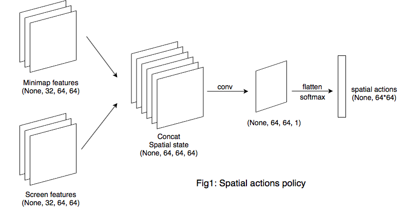
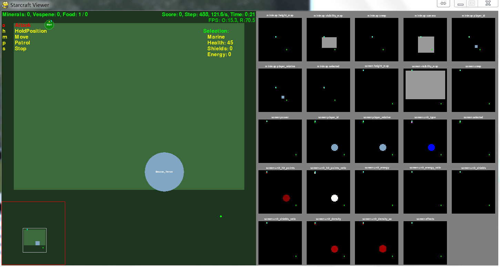

## pysc2 a3c算法性能测试文档

本文档使用a3c算法在pysc2提供的mini game: move to beacon上进行测试。

测试平台为macbook air（i5 4250u，4g），个人台式机（i7 6700k，gtx1070，8g），以及实验室台式机（i7 6700，gtx1080ti，32g）。

### 性能瓶颈分析

1. 内存容量

   a3c代码需要跑多个线程，实验中发现python程序会不断占用内存，单线程下占用1g多，四线程下占用2g多，并且多开进程时，render的starcraft2环境也会占用大量内存，每一个线程占用1g多。八线程下测试时占用12g内存，按照理想情况下跑满16线程，需要内存容量应至少保证32g。

2. 处理器性能

   在a3c的应用场景下，cpu应首选8核cpu，以提供足够的线程数。实验发现，多线程情况下游戏运行速度明显变慢，尤其在跑满cpu线程数时。所以，实际运行可能需要降低线程数，对处理器性能可能有一定要求。在实验过程中也发现，更高的线程数未能给实验效果带来明显提升，具体采用什么算法，多少线程，是否考虑分布式部署，后期还有更多的实验需要完成。

3. gpu

   对特征提取有明显加速效果，但gpu性能不是瓶颈。

事实上，由于a3c算法的同步版本a2c在Atari实验中的效果优于a3c，但a2c对多线程的要求并不高，转而更多利用gpu进行计算，鉴于目前未使用a2c算法进行实验，故对a2c算法在Starcraft2环境的效果不下定论，但应考虑在预算有限的情况下，是否真的需要使用支持16线程的cpu。

### 硬件配置设计

待定

### 实验

#### 1. 实验环境：

pysc2 mini game: MoveToBeacon

#### 2. 实验网络架构

实验算法为a3c，架构采用deepmind pysc2论文里的baseline模型fully convolutional network

论文模型如下：


具体模型架构如下：

首先是policy evaluation阶段，估计$p(a|s)$：

a3c算法中，actor负责根据state（或observation）生成所有action的概率，对于sc2环境，有两种actions的概率需要生成，分别是spatial action与non-spatial action。

1. spatial actions policy 

  

  - minimap convnet

    input: [batch_size, 17, 64, 64]

    conv1: [batch_size, 64, 64, 16], kenel = 5, filters = 16, stride = 1, padding = same

    conv2: [batch_size, 64, 64, 32], kenel = 3, filters = 32, stride = 1, padding = same

  - screen convnet

    input: [batch_size, 42, 64, 64]

    conv1: [batch_size, 64, 64, 16], kenel = 5, filters = 16, stride = 1, padding = same

    conv2: [batch_size, 64, 64, 32], kenel = 3, filters = 32, stride = 1, padding = same

2. non-spatial actions policy

  

  游戏中提供了541条数值信息，来源为

  ```python
  len(pysc2.lib.actions.FUNCTIONS)
  ```

  critic的value也简单通过两个全连接层直接得出（**这里为何要与action选择共享一层参数？？**）

然后是policy improvement阶段，单步迭代更新策略：

critic通过state和reward得出td_error，用于指导policy的提升。

1. value loss

   通过获得最后一个state输入可得最后的value，则以last_value为next_value倒序更新target value（r+gamma\*next_value），最后由target value - value得到advantage，最大化value与因子td_error乘积的值

2. policy loss

  最大化所选动作的对数概率action_log_probability与critic给出的reward（即advantage或者称td_error）乘积的值

#### 3. 具体硬件性能测试情况：

- macbook air

  单线程可运行，速度慢，1 episode 10s左右，2线程时运行过程中出现内存溢出，无法继续实验。

- 台式机（i7 6700k，gtx1070，8g）

  单线程1 episode 3s左右，4线程时出现内存溢出，无法继续实验，3线程可运行，每episode稍慢于单线程。

- 实验室台式机（i7 6700，gtx1080ti，32g）

  单线程1 episode 3s左右，8线程可运行，1 episode 10s左右，慢于单线程情况。

#### 4. 实验截图：



