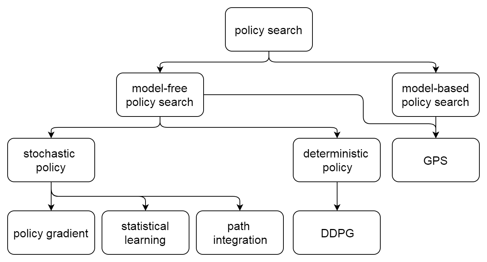

## 写在前面

dppo算法是代表了与a3c算法不同的另一个分支，虽然最后dppo论文是deepmind发的，不过deepmind最代表性的算法还是dqn，a3c之流，代表人物是David Silver，深度强化学习祖师爷Richard Sutton的徒弟。

而openai则是深耕于trust region系算法，如TRPO，PPO等，代表人物是Pieter Abbeel和John Schulman。

因为强化学习不是我主攻方向，对这部分了解也比较肤浅，难免有些错漏或理解不准确的地方，我暂时不打算深入，感兴趣的可以自行去翻翻书和论文。

# trust region系算法简介

> - Author： Sinyer
> - sinyeratlantis@gmail.com

# OUTLINE

- Background
- TRPO
- PPO
- DPPO
- GAE
- ACER
- CPO
- PCL
- trust-PCL
- ACKTR

## Background

- 数值优化问题

- policy gradient 和 ac方法

- 自然梯度与标准梯度

### 数值优化

numerical optimization

- line search: 

  先搜索方向再决定步长
  
- trust region: 

  先确定区域，再用一个model function拟合objective function，通过优化model function得到更新步长和方向
  

### policy gradient

- 由Ronald J. Williams于1992提出的REINFORCE算法演变而来

- 考虑由参数$\theta$控制的随机策略$\pi(\theta)$，通过优化目标函数$J(\theta)$（如expected discounted reward）来更新策略参数，称为policy-based方法

- policy-based方法避免了value-based方法由于value function的bias所导致的policy degradation，且易应用于连续动作空间

- 缺点在于，样本利用率较低，variance较大，导致训练无法收敛

### actor-critic

- 在pg算法中引入value-based方法对value function进行估计

- 对估计的value function减去一个baseline以减少方差

### 自然梯度与标准梯度

natural gradient & standard gradient

- plateau问题

- Natural Gradient Works Efficiently in Learning, Amari, 1998

在神经网络中，参数的坐标系不为正交，参数空间为黎曼空间，此时目标函数的最速下降方向定义为，在参数变化测度为固定值下，最小化目标函数的参数变化的方向：

$$G^{-1}(\theta)\nabla_\theta J$$

其中，$G$称为黎曼度量张量（Reimannian metric tensor）。

对于统计估计问题，参数空间的黎曼结构为Fisher information matrix（FIM），其形式为：

$$F=\mathbb{E}_\theta[\nabla_\theta\log P_\theta(X)\nabla_\theta\log P_\theta(X)^T]$$

FIM与KL散度（Kullback-Leibler divergence）有密切关系。

对于参数$\theta^*$及其邻域的一点$\theta$，$D_{KL}(\theta^*,\theta)=0$，且当$\theta=\theta^*$时KL散度最小，因此KL散度对参数的一阶导数为0，综上用泰勒展开到二阶只剩下二次项，该二次项中的Hessian矩阵（半正定）即为Fisher information matrix（FIM），直观上，它代表着相应参数下似然的梯度的变化率。

- 如果要令参数更新前后，其表征分布间的KL距离为定值，可以令FIM替代上面的度量张量，最速下降方向就由传统梯度$\nabla_\theta J$变为自然梯度$F^{-1}_\theta\nabla_\theta J$，即FIM的逆乘以标准梯度。

- 此举使得策略在相对于参数不太敏感的地方步长更大，而在敏感的地方步长小。

- 当参数空间为欧式空间时，自然梯度即退化成标准梯度。

- Kakade在2001年的论文Natural Policy Gradient将自然梯度引入强化学习中的PG方法。策略参数的更新方向就变为自然梯度。

- Peters等人在2005年的论文Natural Actor-Critic中讨论了它与AC框架的结合。

- 论文Reinforcement Learning of Motor Skills with Policy Gradients对这些工作做了些总结。

## TRPO

Trust Region Policy Optimization, Schulman, J., Levine, S., Moritz, P., Jordan, M. I. & Abbeel, P. 2015

- Trust region policy optimization（TRPO）是一种用于优化策略且保证策略单调改进的迭代方法。

- TRPO通过选择合适的步长使得策略更新后目标函数单调非减。

- 深度神经网络表示的策略，其更新更容易受到bad update的影响，单调非减的约束尤为重要。

### CPI

Kakade在2002年的论文Approximately Optimal Approximate Reinforcement Learning中提出了conservative policy iteration（CPI）方法，该方法在一定的前提下（restart distribution和approximate greedy policy）能找到近似的最优策略。

定义policy performance为expected total discounted reward，记为$\eta$。策略更新前后的policy performance之差可用advantage function的expected reward表示：

$$\eta(\tilde{\pi})=\eta(\pi)+E_{s_0,a_0,\cdots\sim\tilde{\pi}}[\sum_{t=0}^\infty\gamma^t A_\pi(s_t,a_t)]$$

它表示如果策略更新后所有状态的advantage function的值为非负，则policy performance一定增长。

为了避免状态稳态分布对于更新后策略的依赖导致难以优化的问题，这里引入了policy performance的一阶近似$L_\pi(\tilde{\pi})$。

CPI方法中以mixture policy的方式更新策略：

$$\pi_{new}=(1-\alpha)\pi_{old}+\alpha\pi '$$

并且给出了在这种更新方式下policy performance增长的下界。

Trust Region Policy Optimization将这个结论从mixture policy拓展到一般的随机策略。

具体做法是将$\alpha$用total variation divergence在各状态下的最大值$D_{TV}^{\max}(\pi_{old},\pi_{new})$替代，另外考虑total variation divergence和KL散度的关系：

$$D_{TV}(p\parallel q)^2\leq D_{KL}(p\parallel q)$$

可得更新后policy performance的下界为： 

$$L_\pi(\tilde{\pi})-CD_{KL}^{\max}(\pi,\tilde{\pi})$$

其中，$C=\frac{2\epsilon\gamma}{(1-\gamma)^2}$，$\epsilon=\max\limits_s|E_{a\sim\pi '(a|s)}[A_\pi(s,a)]|$

因此问题就转化为最大化这个下界，这个下界也称为原目标函数的代理函数（surrogate function）。

实际中，直接优化这个代理函数会导致步长非常小。

TRPO的做法是用前后策略的KL散度的约束（即trust region constraint）：$D_{KL}^{\max}(\theta_{old},\theta)\leq\delta$ 来代替上面的惩罚项。但由于约束太多，这里就直接用平均KL散度$\bar{D}_{KL}^\rho$代替。

这样，优化问题就变为在$\bar{D}_{KL}^\rho(\theta_{old},\theta)\leq\delta$ 约束下最大化目标函数$L_{\theta_{old}}(\theta)$。

估计$L_{\theta_{old}}$时采用importance sampling，采样分布为：

$$q(a|s)=\pi_{\theta_{old}}(a|s)$$

论文给出两种采样方法：single-path和vine。vine会在轨迹中的每个状态中执行不同动作，其好处是variance低，但缺点是simulate的effort较大。

整个算法的流程有3步：

- 使用single-path或vine采样得到一系列状态-动作对，以及Monte-Carlo法所估计的Q值

- 通过对这些样本求平均得到优化问题中目标和约束的估计

- 近似解决该约束优化问题

  论文采用的是conjugate gradient法加上line search的做法。
  

至此，优化问题可写为：

$$\max_\theta\quad L_{\theta_{old}}(\theta)$$

$$s.t.\quad\bar{D}_{KL}(\theta_{old},\theta)\leq\delta$$

为了计算参数更新方向，先对约束中的KL散度作二次近似：

$$\bar{D}_{KL}\approx\frac{1}{2}(\theta-\theta_{old})^TF(\theta-\theta_{old})$$

其中，$F$为FIM，和natural policy gradient一样，参数更新方向为自然梯度$F^{-1}g$。

因为像神经网络表示策略时会有上千参数，这里如果要生成和求FIM的逆，计算量会非常大，因此这里采用conjugate gradient算法近似求解。若以此为依据更新，则得到Truncated Natural Policy Gradient（TNPG）算法。

TNPG与TRPO区别在于它没有像TRPO一样强制满足约束。TRPO在TNPG的基础上继续通过line search方法在前面选取的方向上再选取步长保证约束强制被满足。

## PPO

Proximal Policy Optimization Algorithms, Schulman, J., Wolski, F., Dhariwal, P., Radford, A. & Klimov, O. 2017

PG方法的缺点是数据效率和鲁棒性不好，同时TRPO方法又比较复杂，且不兼容dropout和参数共享（策略和值函数间）。

PPO算法是对TRPO算法的改进，更易于实现，且数据效率更高。

TRPO方法中通过使用约束而非惩罚项来保证策略更新的稳定性，主要原因是作为惩罚项的话会引入权重因子，而这个参数难以调节。

TRPO中为了解优化问题，先线性近似目标函数，二阶近似约束，最后通过conjugate gradient算法和line search求解。

PPO尝试通过一阶优化的方法来解，与TRPO中用约束来限制策略更新幅度不同，PPO中采用了惩罚项（正则项）的做法。论文提出了基于clipped probability ratio的目标函数。

首先定义probability ratio：

$$r_t(\theta)=\frac{\pi_\theta(a_t|s_t)}{\pi_{\theta_{old}}(a_t|s_t)}$$

TRPO的代理目标函数（CPI方法中的目标函数）可表示为：

$$L^{CPI}(\theta)=\hat{\mathbb{E}}_t[r_t(\theta)\hat{A}_t]$$

这样的目标下策略更新有可能会很大。因此，clipping目标函数中加入了clip项: 

$$L^{CLIP}(\theta)=\hat{\mathbb{E}}_t[\min(r_t(\theta)\hat{A}_t,\mathrm{clip}(r_t(\theta),1-\epsilon,1+\epsilon)\hat{A}_t)]$$

其中，$\epsilon$为超参数，clip项促使得$r_t$不偏离 [ 1 − $\epsilon$ , 1 + $\epsilon$ ] 所定义的区间。

直观上，当策略更新的偏移超出预定区间而获得更大的目标函数值时，这个clip项就会产生影响。

另外一种目标函数是采用自适应的KL惩罚项系数，实验中效果不及clipping目标函数，其形式为： 

$$L^{KLPEN}(\theta)=\hat{\mathbb{E}}_t[\frac{\pi_{\theta}(a_t|s_t)}{\pi_{\theta_{old}}(a_t|s_t)}\hat{A}_t-\beta KL[\pi_{\theta_{old}(\cdot|s_t)},\pi_{\theta(\cdot|s_t)}]]$$

其中，当策略更新前后KL散度小于预定值时，惩罚项系数$\beta$减小到原来的一半，当大于预定值时，系数增加一倍。

如果使用神经网络共享policy和value function参数的话，就需要在损失函数中结合策略优化目标和值函数的误差项：

$$L^{CLIP+VF+S_t}(\theta)=\hat{\mathbb{E}}_t[L^{CLIP}_t(\theta)-c_1L^{VF}_t(\theta)+c_2S[\pi_\theta](s_t)]$$

其中的$c_1$和$c_2$为系数，$S$为策略熵，$L_t^{VF}$为值函数误差项。整个PPO算法每次迭代中，先通过执行当前策略，估计优势函数，然后通过优化代理函数更新策略参数。

## DPPO

Emergence of Locomotion Behaviours in Rich Environments,  Heess, N. et al. 2017

DPPO是DeepMind于2017年提出的分布式的PPO算法。

很多的RL算法假设有well-defined的回报函数，但在很多场景中，尤其是连续动作空间控制问题中，这个假设并不成立。

论文讨论的一个重点就是如何只利用简单的回报函数，通过丰富多变的环境来学习到稳定的行为。为了达到这个目的，需要改善RL算法的伸缩性。

PG方法的缺点是variance高，且对超参数敏感。

TRPO通过trust region约束处理variance问题，PPO将trust region约束实现为正则项。

而在DPPO算法中，数据的收集和梯度的计算被分布到多个worker中，思想类似于A3C算法。原始的PPO算法通过完整的回报和估计策略优势，DPPO为了便于使用batch update的RNN，论文使用了K-step returns来估计策略优势。

DPPO算法分为两部分：chief和worker。

worker部分在每次迭代中依次做M步策略参数和B步值函数参数的更新。chief部分从worker收集梯度，收集指定个数之后，将它们的均值更新到总的参数。

对于每个worker，每轮迭代中按当前策略执行T步，然后把它们按K个数据一份分好，对于每K步样本，估计优势函数，然后分别通过梯度$\nabla_\theta J_{PPO}$和$\nabla_\phi L_{BL}$更新相应参数。另外它会根据当前策略和之前策略的KL距离是否超出区域调节目标函数中的系数$\lambda$。

论文用TensorFlow实现了DPPO算法，workers在每次梯度更新后同步它们的参数。

### GAE

High-Dimensional Continuous Control Using Generalized Advantage Estimation, Schulman, J., Moritz, P., Levine, S., Jordan, M. I. & Abbeel, P. 2016

PG方法中采用神经网络作为非线性函数逼近器常常会遇到两个问题：

- 需要大量的样本

- 在数据并不稳定的情况下策略无法稳定更新。

第一个问题可以用优势函数的指数加权估计（Exponentially-weighted estimator）解决。

第二个问题可以用对策略和值函数（用神经网络表示）的trust region优化来解决。

PG是估计参数化概率策略的经典方法，PG方法中的每次更新应该提高那些能够好于平均动作的概率，同时减少差于平均动作的概率。

但是PG方法的variance很高，因此AC算法通过使用值函数代替经验回报（Empirical return）以引入bias为代价降低variance，但事实上bias有时往往更加有害。

论文主要讨论在控制bias的前提下大大减少variance。以$\gamma$和$\lambda$作为两个可调参数，提出了GAE（generalized advantage estimator）方法。

PG中的梯度：

$$g=\nabla_\theta\mathbb{E}[\sum\limits_{t=0}^\infty r_t]$$

具体可以写成通用形式： 

$$g=\mathbb{E}[\sum\limits_{t=0}^\infty \Psi_t\nabla_\theta\pi_\theta(a_t|s_t)]$$

其中，选择优势函数 $\Psi_t=A^\pi(s_t,a_t)$ 时，variance最小。

优势函数用于定量地表示一个动作好于还是坏于平均行为。因此论文主要在讨论优势函数的估计。总得来说，GAE$(\gamma,\lambda)$是k步估计的指数加权移动平均。

这里把discounted MDP中的折扣因子 $\gamma$ 作为该模型中用于减少variance的参数。另一个参数类似于TD$(\lambda)$中的$\lambda$，用于不同k-step 优势函数估计的权重。这两个参数都可用于bias-variance之间的tradeoff。

考虑$\gamma,\lambda$这两个参数，优势函数的估计就是各k步估计的指数加权平均：

$$\hat{A}_t^{GAE(\gamma,\lambda)}=\sum\limits_{l=0}^\infty(\gamma\lambda)^l\delta_t^V$$

这里的策略和值函数都是采用神经网络表示。和TRPO方法类似，这里也用了trust region方法。不同的是它除了用于策略更新，还用于值函数估计。

## ACER

Sample Efficient Actor-Critic with Experience Replay,  Wang, Z. et al. 2017

之前很多RL方法的成功需要大量模拟，也就是说它们是样本利用率不高。

像DQN这样的基于值函数估计方法在这方面会好些，但DQN有自己的缺点，如不能用于连续动作空间。

而PG方法中经典的A3C算法也有样本利用率低的问题。

因此，这篇文章的目标就是要设计稳定的数据效率高的AC方法并能应用于连续和离散的动作空间。

本文引入了Actor critic with experience replay(ACER)算法，它和DQN的性能差不多，且比A3C在Atari实验场景中和连续控制领域的数据效率好很多。

ACER算法引入很多创新点：

- truncated importance sampling with bias correction

- stochastic dueling network architectures

- efficient trust region policy optimization

这里主要看下它对TRPO的改进。

TRPO算法中采用了conjugate gradient方法求解，会有很多Fisher-vector乘积运算，因此在大规模问题中计算量十分巨大。

与TRPO方法通过约束条件限制策略更新，ACER算法中维护average policy network用于表示过往策略的滑动平均，并保持策略更新不偏离这个均值。这个average policy network用$\phi_{\theta_a}$表示。

深度神经网络参数记为$\theta$，它的输出作为策略分布$\pi(\cdot|x)=f(\cdot|\phi_\theta(x))$的统计量。ACER的策略梯度记为$\hat{g}_t^{acer}$。引入trust region后，可转为约束问题：

$$\min\limits_z\frac{1}{2}\parallel\hat{g}^{acer}_t-z\parallel^2_2$$

$$s.t.\quad\nabla_{\phi_\theta}D_{KL}[f(\cdot|\phi_{\theta_a}(x_t))\parallel f(\cdot|\phi_\theta(x_t))]^Tz\leq\delta$$

注意该约束为线性，因此整个问题可转为二次规划问题，有解析解： 

$$z^*=\hat{g}^{acer}_t-\max\{0,\frac{k^T\hat{g}^{acer}_t-\delta}{||k||^2_2}\}k$$

直观上，这个解表示在约束满足的情况下，则解即为$\hat{g}^{acer}$，如果不满足，则沿k方向减少。

以上是第一阶段，第二阶段中使用反向传播（Back propagation, BP）算法，更新网络参数$\theta$的梯度为：

$$\partial\phi_\theta(x)\partial_\theta z^*$$

和TRPO方法中用二次近似约束中的DKL不同，这种方法将约束写为线性形式，因此可以通过解析解得到目标对于$\phi_\theta$的梯度，然后通过NN更新$\phi_\theta$对于$\theta$的梯度，从而避免了Fisher-vector计算，因此更适合大规模问题。

## CPO

Constrained Policy Optimization,  Achiam, J., Held, D., Tamar, A. & Abbeel, P. 2017

有些场景下，我们需要限定约束防止灾难性后果。比如工业机器人或者飞行器控制，如果不加限制可能会导致经济损失甚至有安全隐患。文章提出Constrained Policy Optimization（CPO）方法，是一种可以保证在每一次迭代中满足约束的通用策略搜索算法。

基于CMDP（constrained Markov decision process）模型，该模型引入一组代价函数$C_1,\cdots,C_m$，其中，$C_i:S\times A\times S\to R$。

目标函数$J_{C_i}$代表以$C_i$为代价函数的策略$\pi$下的期望折扣回报。

$\Pi_C$为对于所有$i$，满足$J_{C_i}(\pi)\leq\mathrm{d}i$的策略集合。最优策略即是在这个集合当中目标函数最大的策略。

基于TRPO，在CMDP下的策略搜索问题可以记为： 

$$\pi_{k+1}=\arg\max\limits_{\pi\in\Pi_\theta}J(\pi)$$

$$s.t.\quad J_{C_i}(\pi)\leq di\quad i=1,\cdots,m\quad D(\pi,\pi_k)\leq\delta$$

具体地，选定DKL作为测度，即CPO算法。和TRPO一样，为了避免过小的更新，用约束替代惩罚项： 

$$\pi_{k+1}=\arg\max\limits_{\pi\in\Pi_\theta}\mathbb{E}_{s\sim d^\pi k}[A^{\pi_k}(s,a)]$$

$$s.t.\quad J_{C_i}(\pi_k)+\frac{1}{1-\gamma}\mathbb{E}_{s\sim d^\pi k,a\sim\pi}[A^{\pi_k}_{C_i}(s,a)]\leq\mathrm{d}i\quad\forall i$$

$$\bar{D}_{KL}(\pi||\pi_k)\leq\delta$$

当参数空间维度很大时，上式的计算量非常大。把目标函数和代价约束通过线性近似，KL散度约束通过泰勒二阶展开近似后，可得： 

$$\theta_{k+1}=\arg\max\limits_\theta g^T(\theta-\theta_k)$$

$$s.t.\quad c_i+b^T_i(\theta-\theta_k)\leq 0\quad i=1,\cdots,m$$

$$\frac{1}{2}(\theta-\theta_k)^TH(\theta-\theta_k)\leq\delta$$

该问题为凸优化，可通过对偶问题解决。先构造更易解的对偶问题，它是有解析解的。解完对偶问题，即可根据对偶问题的解构造原问题的解。但由于近似误差，可能解并不能满足约束了，因此，还需要进行回溯线搜索（Backtracking linesearch）保证满足约束。

## PCL

Bridging the Gap Between Value and Policy Based Reinforcement Learning, Nachum, O., Norouzi, M., Xu, K. & Schuurmans, D. 2017

这篇论文中提出了Path Consistency Learning (PCL)算法。

我们知道，最初RL算法分value-based和policy-based两大类。policy-based方法最大的缺点是效率低。另外策略梯度通过rollout来估计的话会导致variance很大。

为了解决这个问题，AC算法通过值函数估计来替代rollout估计，以引入bias为代价减小了variance。尽管如此，如果这个值函数估计是on-policy的话仍然会面临样本数据效率的问题（因为要么用on-policy数据，要么更新足够慢以防止bias），而off-policy算法（如Q-learning）现实使用中需要花很大力气进行超参数调节才能稳定。

为了结合on-policy训练的无偏性和稳定性，和off-policy的数据效率，off-policy AC方法出现了，但它仍没有解决在有函数近似（Function approximation）下的off-policy学习的一些理论问题。在这个背景下，这篇文章研究了熵正则化下策略优化和softmax value consistency的关系，提出了一种稳定的off-policy学习方法。

首先假设策略是以神经网络定义的分布$\pi_\theta(a|s)$，Q-learning基于hard-max Bellman公式，通过hard-max Bellman时域一致性（Temporal consistency）来更新参数。定义$O_{ER}(s,\pi)$为期望折扣回报。因为最优策略是通过$\pi^*=\arg\max\limits_\pi O_{ER}(s,\pi)$来计算，因此策略为one-hot分布。

本文主要研究softmax temporal consistency。它在传统的期望回报目标函数中加了折扣熵正则项（Discounted entropy regularizer）。这个正则项可以帮助exploration，避免过早收敛到次优解。正则化后的期望回报可以写成： 

$$O_{ENT}(s,\pi)=O_{ER}(s,\pi)+\tau\mathbb{H}(s,\pi)$$

其中，$\mathbb{H}(s,\pi)$为折扣熵项（discounted entropy term）。当$\tau>0$时，最优解不再是one-hot分布，最优解可以表示为： 

$$\pi^*(a|s)\propto\exp{(r(s,a)+\gamma V^*(s'))/\tau}$$

文中给出了对于任意状态和动作的时域一致性属性（temporal consistency property），它可以被推广到多步情况下： 

$$V^*(s_1)-\gamma^{t-1}V^*(s_t)=\sum\limits_{i=1}^{t-1}\gamma_{i-1}[r(s_i,a_i)-\tau\log\pi^*(a_i|s_i)]$$

即对于给定状态动作序列下的时域一致性。基于此，PCL的目标是对于给定子轨迹（Sub-trajectory），上式中等式左边和右边之差尽可以接近于0。设$\phi$和$\theta$分别为值函数和策略的参数，PCL的目标可表示为：

$$O_{PCL}(\theta,\phi)=\sum\limits_{s_{i:i+d}\in E}\frac{1}{2}C(s_{i:i+d},\theta,\phi)^2$$

其中$C(s_{i:i+d},\theta,\phi)$为对于长度为$d$的子轨迹，上面推论中等式左右边之差。然后就可以用梯度更新参数了，它可适用于on-policy和off-policy策略。

如果将soft consistency error用$Q$函数来表示的话，$Q_\rho$以$\rho$为参数，则值函数和策略都可以用$Q$函数表示: 

$$V_\rho(s)=\tau\log\sum\limits_a\exp Q_\rho(s,a)/\tau$$

$$\pi_\rho(a|s)=\exp(Q_\rho(s,a)-V_\rho(s))/\tau$$

它将策略和值函数结合成一个模型，然后只要通过梯度更新一个参数$\rho$即可。这称为Unified PCL（Unified Path Consistency Learning）。结果表示，与PCL相比Unified PCL方法在一些简单任务中表现不好，但在一些复杂任务中表现更好。

## trust-PCL

Trust-PCL: An Off-Policy Trust Region Method for Continuous Control, Nachum, O., Norouzi, M., Xu, K. & Schuurmans, D. 2017

TRPO为代表的trust region系方法一个缺点是需要大量和环境的交互。

Google Brain提出的Trust-PCL是一种off-policy trust region算法，是对上面的PCL算法的改进。它既保证了优化的稳定性又充分利用了off-policy数据提高了样本效率。

现有的off-policy方法（包括DDPG）虽提高了数据效率，但是代价是优化的稳定性。另外DDPG高度依赖于超参数选择和初始化。另一方面，为了提高稳定性和policy-based RL方法的收敛速度，Kadade基于Amari的工作提出了natural policy gradient算法，继而Schulman根据该工作提出了TRPO。但它的缺点是无法利用off-policy数据。

一个自然的想法就是结合这两者的优点，兼具trust region policy-based方法的稳定性，和好的样本数据效率。

多数的policy-based方法（如REINFORCE算法）的基本思想是先参数化策略然后最大化期望回报$O_{ER}(s,\pi)$。

PCL给这个目标函数添加了折扣熵正则项$\mathbb{H}(s,\pi)$。Nachum等人的论文中证明了$O_{ENT}$的最优策略$\pi^*$和最优目标值$V^*(s)=O_{ENT}(s,\pi^*)$之间对于任意状态动作序列符合softmax temporal consistency constraint。

在TRPO方法中，为了避免传统policy-based算法（优化OEROER）中的稳定性问题，引入了当前策略下的每个状态下KL散度的平均作为测度的trust region。

结合了这种思想，在PCL优化OENTOENT的基础上，加上折扣相对熵依赖域（Discounted relative-entropy trust region），于是就有了下面的约束优化问题： 

$$\max\limits_\pi\ \mathbb{E}_s[O_{ENT}(\pi)]$$

$$s.t.\quad\mathbb{E}_s[\mathbb{G}(s,\pi,\tilde{\pi})\leq\epsilon]$$

其中的折扣相对熵有递归定义： 

$$\mathbb{G}(s,\pi,\tilde{\pi})=\mathbb{E}_{a,s'}[\log\pi(a|s)-\log\tilde{\pi}(a|s)+\gamma \mathbb{G}(s',\pi,\tilde{\pi})]$$

注意目标函数中熵正则化与约束中的相对熵信赖域的区别。前者可以鼓励exploration，而后者可以提高稳定性，加快训练速度。通过引入拉格朗日乘子，可以将上面的约束问题转为非约束问题：

$$O_{RELENT}(s,\pi)=O_{ENT}(s,\pi)-\lambda \mathbb{G}(s,\pi,\tilde{\pi})$$

该式类似于$O_{ENT}$，可以分解为两部分：

$$O_{RELENT}(s,\pi)=\tilde{O}_{s,\pi}+(\tau+\lambda)\mathbb{H}(s,\pi)$$

其中，$\tilde{O}_{ER}(s,\pi)$为变换后回报函数$\tilde{r}(s,a)=r(s,a)+\lambda\log\tilde{\pi}(a|s)$下的期望回报目标。

该目标下的最优值函数记为$V^*(s)$，最优策略记为$\pi^*(a|s)$，然后在此基础上将PCL中的结论拓展过来，可以得到下面的softmax temporal consistency constraint： 

$$V^*(s_0)=E_{r_i,a_i,s_i}[\gamma^dV^*(s_d)+\sum\limits_{i=0}^{d-1}\gamma^i(r_i-(\tau+\lambda)\log\pi^*(a_i|s_i)+\lambda\log\tilde{\pi}(a_i|s_i))]$$

类似地，定义一致性误差（Consistency error）$C(s_{t:t+d},\theta,\phi)$为上式等式左右边之差，我们的目标就是对于每个子轨迹使这个一致性误差的平方最小化，因此可以用梯度下降法更新策略和值函数的参数$\theta$和$\phi$。这就是trust-PCL的主要精神。

Trust-PCL比TRPO算法更加易于实现，它只需要简单的梯度下降。同时实验中发现Trust-PCL在一些控制任务中在平均回报和样本效率上优于TRPO。

## ACKTR

Scalable trust-region method for deep reinforcement learning using Kronecker-factored approximation,  Wu, Y., Mansimov, E., Liao, S., Grosse, R. & Ba, J. 2017

最近提出的Kronecker-factored方法可用于近似曲率矩阵。

这篇文章扩展了natural policy gradient框架，利用Kronecker-factored approximate curvature(K-FAC)方法优化AC方法中的actor和critic，即策略和值函数的估计，提出了Actor Critic using Kronecker-Factored Trust Region(ACKTR)方法。

前面提到自然梯度可以用于提高样本利用率。但计算自然梯度需要计算FIM的转置，这是计算量非常大的操作。

TRPO中使用conjugate gradient descent替代FIM的存储和求逆操作，只需要求FIM和向量的积。但它需要在每次参数更新时迭代求解。这阻碍了TRPO应用在大规模问题中。

James Martens和Roger Grosse在论文Optimizing Neural Networks with Kronecker-factored Approximate Curvature中提出了神经网络中的自然梯度近似方法K-FAC（Kronecker-factored Approximate Curvature），它可以显著减少计算量。

ACKTR算法将之应用到AC算法的actor和critic中。实际中，ACKTR每步更新的计算量只比基于随机梯度下降（Stochastic gradient descent, SGD）方法高10%~25%，同时实验结果表明ACKTR在Atari和MuJoCo场景中性能比A2C和TRPO好得多。

## 算法参考实现

- [OpenAI baselines](https://github.com/openai/baselines)：OpenAI的一些增强学习算法实现。包括A2C，ACKTR, DDPG, DQN, PPO和TRPO。

- [TensorFlow Research Models](https://github.com/tensorflow/models/tree/master/research/pcl_rl)：实现了REINFORCE, TRPO, PCL, Unified PCL等算法。

- [rllab](https://github.com/rll/rllab)：论文Benchmarking Deep Reinforcement Learning for Continuous Control中涉及到的算法实现。包括REINFORCE, TNPG, RWR, REPS, TRPO, CEM, CMA-ES和DDPG。

- [TensorFlow Agents](https://github.com/tensorflow/agents) ：实现了BatchPPO算法。它是PPO算法的优化。

- [modular_rl](https://github.com/joschu/modular_rl)： John Schulman的一些算法实现，包括TRPO, PPO，CEM。

- [Tensorflow-RL](https://github.com/steveKapturowski/tensorflow-rl)：基于TensorFlow实现的A3C, PGQ, TRPO, DQN+CTS 和CEM算法。

- [openai/imitation](https://github.com/openai/imitation)：生成对抗模仿学习的实现代码，包含了TRPO算法。

## 参考文献：

- [深度增强学习漫谈 - 信赖域系方法](http://blog.csdn.net/jinzhuojun/article/details/78007628)

